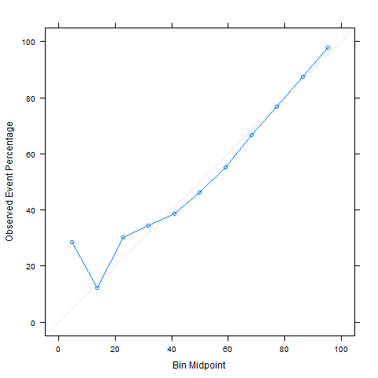

# Classifying NBA shots

In this notebook, different machine learning models are used to predict whether a basketball shot is successful (hits the basket and scores a point) or not. Specifically, we'll look at all the basketball shots made during the 2014-2015 NBA season scraped from the NBA's API and provided on kaggle [(https://www.kaggle.com/dansbecker/nba-shot-logs/home)](https://www.kaggle.com/dansbecker/nba-shot-logs/home).

## Main Results
The best model turns out to be a XGBoost-flavoured Boosted Trees model. The following calibration plot demonstrates that the model is very good at predicting the average success rate of most shots. The accuracy at 62% is better than appears at first, once the inherent noisiness of basektball shots is taken into account.

The full set of results with a lot more details on the data, methodology and results can be found in the [Results.md](Results.md) file.

The files [01_pre_process.R](01_pre_process.R), [02_eda.R](02_eda.R) and [03_train_predict.R](03_train_predict.R) contain the R code.
