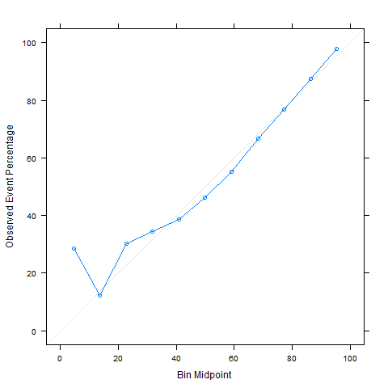

# Objective
The goal is to predicct whether a given shot from the 2014-15 NBA season is succeful i.e. goes into the basket and scores a point or not.

# Train-test Methodology
I perform an **80-20** timeseries train-test sample split, i.e. I order games along the time dimension by date and then assign the first 80% of games to the train test and the remaining 20% to the test set. The timeseries split is used to avoid information leakage from data that are not available at the time when a hypothetical prediction would be made. I fit and tune different ML models on the train set, evaluate their out-of-sample performance using cross-validation and verify the performance of the seemingly best model on the test-set.

# EDA

## Feature generation

### Original features
For each recored shot, the data contains information on

+ whether the shot was succesful
+ the **player shooting**
+ the **distance to the basket** (= shot distance)
+ whether the shot was worth **two or three points**
+ who the **closest opposing defender** was
+ the **distance to the closest defender**
+ the **matchup/game** and date (e.g. Boston vs Philadelphia on 04/11/2015)
+ whether the game was a **home or away game** (from the perspective of the player shooter)
+ what the **final margin** of the game was (e.g. +5 if the shooter's team won by five points)
+ the quarter **period of the game**
+ the time on the **game clock**
+ the **number of dribbles** performed by the player immediately before taking the shot

### Additional features

Since close-distance shots tend to have much higher success rates than long-distance shots, I generate two additional features

1. I bin the shot distance into
  + close (0ft to 7ft)
  + semi-close (7ft to 14ft)
  + semi-far (14ft to 23.75ft)
  + far (beyond 23.75ft)
2. For each of the shot distance bins, a Bayesian estimate of the (shooting) player's true shot percentage for that distance bin based on past performance.

### Leveraging Empirical Bayes

Given that shot percentage are constrained to lie between 0 and 1, for each shot distance bin, I calculate each player's shot percentage. For each shot distance bin I then fit a beta distribution to the shot percentage data. As expected, the prior distribution for close-distance shot percentages has a higher mean than e.g. the one for long-distance shot percentages.

#### Prior distribution for close distance shots

#### Prior distribution for long distance shots

Using these distributions as the prior and the player's past shot performance in a given shot distance bin as the likelihood, I estimate a player's true shot percentage for a given shot distance bin as the mean from the resulting posterior distribution.

Using Bayesian updating to estimate the true shot percentage improves over simpler approaches such as e.g taking the average past success rate, by reducing the noisiness of the resulting feature. Consider for example a player who has just taken three shots from a given shot distance pocket, all of which happened to be unsuccesful. Given that we only have three observations, the Bayesian estimate will lie close to the overall average for that shot pocket, as the prior will mostly overrule the evidence, whereas a simple average would provide an unrealistic estimate of 0%.

## Importance of shot distance and defender distance

### Frequency of shots

Plotting shot density in the shot-distance-closest-defender-distance space reveals that most shots are taken either from a short distance, or from beyond the 3-point line (from where a succesful shot is worth three rather than two points).

### Density difference of succesful and unsuccesful shots

It also becomes clear that while long-distance shots are not as actively defended (the closest defender tends to be further away) they have a lower success rate. The same is true for closely defended mid-range shots.

# ML models used

I fit and tune the following models:

+ Regularised (Lasso) Logit Regression
+ Random Forrests
+ Support Vector Machine
+ Boosted Classification Trees (XGBoost)

As error function to be minimised, I use the negative **Log-Loss** i.e. $L = -[\unicode{x1D7D9}(y=success) ln(\widehat{p}) + \unicode{x1D7D9}(y=fail)ln(1-\widehat{p})]$.

# Results

## Model comparison and evaluation

Using cross-validation on the training set, I approximate the distribution of out-of-sample performance of each model. Boosted Trees clearly has the best performance.

Using the Boosted Trees model to predicting the success of shots in the test set yields an accuracy of 62.4%, given a no-information rate of 55% (i.e. the accuracy that would be attained with just predicting every shot to miss its target).

The confusion matrix is as follows:

|         | Realisation |   |
| ------------- |:-------------:| -----:|
| **Prediction**        | made  | missed  |
| made      | 4424 | 2613 |
| missed      | 6591 | 10866 |

While this might appear to be a low accuracy at first, keeping in mind the stochastic nature of basketball shots, this is not a bad result. In particular, looking at the calibration plot (below) for the test set shots shows the Boosted Trees model is very good at predicting the shot percentage of a given shot. The only exception is the lowest bucket of shots, i.e. those shots for which the model on average predicts a success rate of about 5 percent, but which end up being succesful about 30 percent of the time. Otherwise, predicted and realised success rates line up very closely.

### Calibration plot for Boosted Trees model

