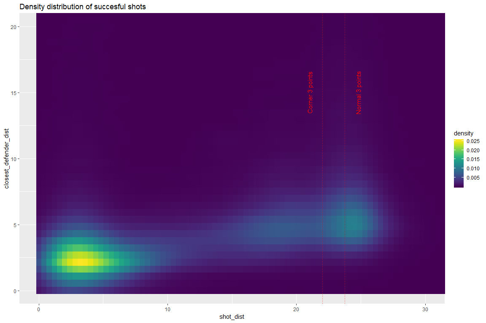
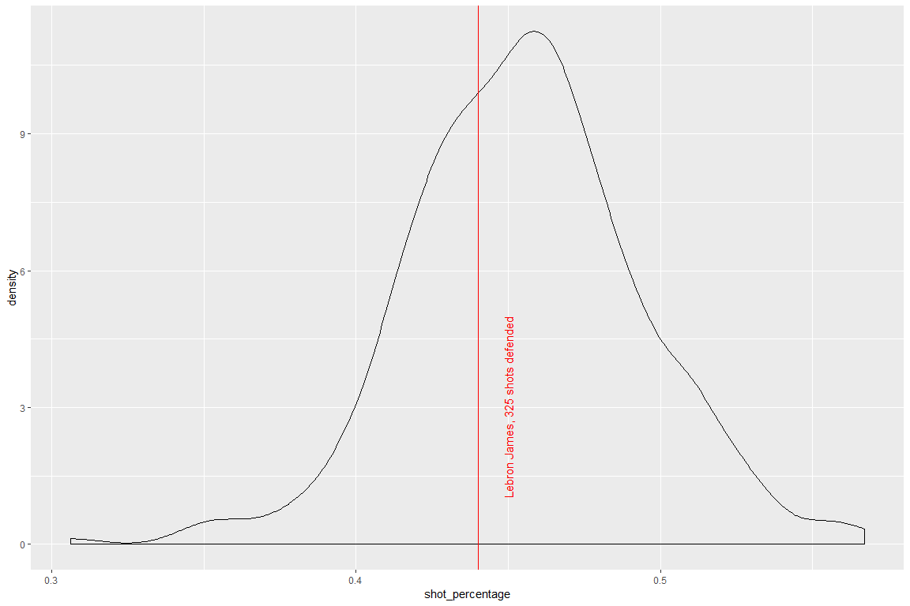
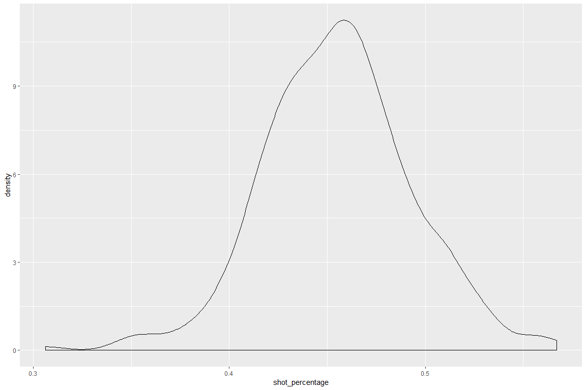

Predicting NBA shots
================

Introduction
============

In this notebook, regression and machine learning techniques are used to predict whether a basketball shot is succesful (hits the basket and scores a point) or not. SPecifically, we'll look at all the basketball shots made during the 2014-2015 NBA season scraped from the NBA's API and provided on kaggle [(https://www.kaggle.com/dansbecker/nba-shot-logs/home)](https://www.kaggle.com/dansbecker/nba-shot-logs/home).

Set up
======

``` r
# Code which explores the NBA shot log data
# clear workspace
remove(list = ls())
# clear console
cat("\014")

# load packages
library(caret)
library(tidyverse)
library(skimr)
library(ggplot2)
library(tictoc)
library(corrplot)
library(pROC)
library(viridis) # for density plot
library(rpart.plot)

path_project <- "C:/Users/Mats Ole/Desktop/predicting_nba_shots/"
path_rel_data <- "data_input/"
name_data <- "shot_logs.csv"
```

Data cleaning
=============

First, let's clean and rename the data.

Data exploration
================

Summary stats
-------------

``` r
kable(skim(df_clean))
```

Skim summary statistics
n obs: 122502
n variables: 20

Variable type: factor

|      variable     | missing | complete |    n   | n\_unique |                top\_counts                | ordered |
|:-----------------:|:-------:|:--------:|:------:|:---------:|:-----------------------------------------:|:-------:|
| closest\_defender |    0    |  122502  | 122502 |    473    |   Iba: 802, Jor: 786, Gre: 737, Gas: 716  |  FALSE  |
|      game\_id     |    0    |  122502  | 122502 |    896    |   214: 191, 214: 187, 214: 183, 214: 181  |  FALSE  |
|      matchup      |    0    |  122502  | 122502 |    1792   |    FEB: 102, NOV: 99, DEC: 97, JAN: 97    |  FALSE  |
|    player\_name   |    0    |  122502  | 122502 |    281    | lam: 1010, jam: 1006, mnt: 1004, kla: 953 |  FALSE  |
|     pts\_type     |    0    |  122502  | 122502 |     2     |         2: 90852, 3: 31650, NA: 0         |  FALSE  |
|    shot\_result   |    0    |  122502  | 122502 |     2     |       mis: 66622, mad: 55880, NA: 0       |  FALSE  |

Variable type: integer

|        variable       | missing | complete |    n   |    mean   |    sd    |  p0 |  p25  |  p50  |  p75  |  p100  |                               hist                               |
|:---------------------:|:-------:|:--------:|:------:|:---------:|:--------:|:---:|:-----:|:-----:|:-----:|:------:|:----------------------------------------------------------------:|
| closest\_defender\_id |    0    |  122502  | 122502 | 159120.43 | 78689.68 | 708 | 2e+05 | 2e+05 | 2e+05 | 530027 | <U+2582><U+2581><U+2581><U+2587><U+2581><U+2581><U+2581><U+2581> |
|        dribbles       |    0    |  122502  | 122502 |    1.99   |   3.41   |  0  |   0   |   1   |   2   |   32   | <U+2587><U+2581><U+2581><U+2581><U+2581><U+2581><U+2581><U+2581> |
|     final\_margin     |    0    |  122502  | 122502 |   10.78   |   7.81   |  1  |   5   |   9   |   15  |   53   | <U+2587><U+2586><U+2583><U+2582><U+2581><U+2581><U+2581><U+2581> |
|         period        |    0    |  122502  | 122502 |    2.47   |   1.14   |  1  |   1   |   2   |   3   |    7   | <U+2587><U+2587><U+2587><U+2587><U+2581><U+2581><U+2581><U+2581> |
|       player\_id      |    0    |  122502  | 122502 | 157334.91 | 79304.95 | 708 | 1e+05 | 2e+05 | 2e+05 |  2e+05 | <U+2582><U+2581><U+2581><U+2581><U+2581><U+2581><U+2581><U+2587> |
|          pts          |    0    |  122502  | 122502 |    1.01   |   1.13   |  0  |   0   |   0   |   2   |    3   | <U+2587><U+2581><U+2581><U+2581><U+2581><U+2586><U+2581><U+2582> |
|      shot\_number     |    0    |  122502  | 122502 |    6.48   |   4.68   |  1  |   3   |   5   |   9   |   37   | <U+2587><U+2585><U+2582><U+2581><U+2581><U+2581><U+2581><U+2581> |

Variable type: logical

|  variable  | missing | complete |    n   | mean |             count             |
|:----------:|:-------:|:--------:|:------:|:----:|:-----------------------------:|
| home\_game |    0    |  122502  | 122502 |  0.5 | FAL: 61315, TRU: 61187, NA: 0 |
|     win    |    0    |  122502  | 122502 | 0.51 | TRU: 62149, FAL: 60353, NA: 0 |

Variable type: numeric

|           variable          |  missing | complete |    n   |   mean   |    sd    |   p0   |  p25  |  p50  |  p75  |  p100 |                               hist                               |
|:---------------------------:|:--------:|:--------:|:------:|:--------:|:--------:|:------:|:-----:|:-----:|:-----:|:-----:|:----------------------------------------------------------------:|
|   closest\_defender\_dist   |     0    |  122502  | 122502 |   4.12   |   2.75   |    0   |  2.3  |  3.7  |  5.3  |  53.2 | <U+2587><U+2581><U+2581><U+2581><U+2581><U+2581><U+2581><U+2581> |
|         game\_clock         |     0    |  122502  | 122502 | 21664.11 | 12121.46 |   60   | 11220 | 21720 | 32160 | 43200 | <U+2587><U+2587><U+2587><U+2587><U+2587><U+2587><U+2587><U+2587> |
|         shot\_clock         |     0    |  122502  | 122502 |   12.45  |   5.76   |    0   |  8.2  |  12.3 | 16.67 |   24  | <U+2582><U+2585><U+2586><U+2587><U+2587><U+2586><U+2585><U+2583> |
|          shot\_dist         |     0    |  122502  | 122502 |   13.44  |   8.78   |    0   |  4.7  |  13.4 |  22.4 |  43.5 | <U+2587><U+2585><U+2583><U+2585><U+2587><U+2581><U+2581><U+2581> |
|         touch\_time         |     0    |  122502  | 122502 |   2.75   |   2.96   | -100.5 |  0.9  |  1.6  |  3.7  |  24.9 | <U+2581><U+2581><U+2581><U+2581><U+2581><U+2581><U+2587><U+2581> |
| \#\# Overall shot percentag |     e    |          |        |          |          |        |       |       |       |       |                                                                  |
|  45.6% of the shots are su  | ccesful. |          |        |          |          |        |       |       |       |       |                                                                  |

``` r
mean(df_clean$shot_result == "made")
```

    ## [1] 0.4561558

Correlations among predictors
-----------------------------

There are some expected correlations among the predictors:

-   As shot distance increases, so does the space a defender gives the shooting player.
-   Number of dribbles taken by the player who makes the shots and the amount of time the player has had the ball in his hands are naturally highly correlated.
-   The number of the shot and the number of the game period/quarter are also expected to be correlated.

``` r
correlations <- cor(df_clean %>% select_if(is.numeric))
corrplot(correlations, order = "hclust")
```



Close and uncontested shots are more succesful
----------------------------------------------

``` r
ggplot(df_clean %>% 
         filter(shot_result == "made"), aes(x = shot_dist, 
                                            y = closest_defender_dist)) +
  stat_density2d(aes(fill = ..density..), contour = F, geom = 'tile') +
  scale_fill_viridis() + ggtitle("Density distribution of succesful shots") +
  coord_cartesian(xlim = c(0, 30), ylim = c(0, 20)) +
  geom_vline(xintercept = 22, linetype = "dotted", colour = "red") +
  geom_vline(xintercept = 23.75, linetype = "dotted", colour = "red") +
  geom_vline(xintercept = 23.75, linetype = "dotted", colour = "red") +
  annotate("text", x = 21, y = 15, 
           label = paste("Corner 3 points"), 
           size = 4, angle = 90, colour = "red") +
  annotate("text", x = 24.75, y = 15, 
           label=paste("Normal 3 points"), 
           size = 4, angle = 90, colour = "red")
```


``` r
ggplot(df_clean %>% filter(shot_result == "missed"), aes(x = shot_dist, y = closest_defender_dist)) +
  stat_density2d(aes(fill = ..density..), contour = F, geom = 'tile') +
  scale_fill_viridis() + ggtitle("Density distribution of unsuccesful shots") +
  coord_cartesian(xlim = c(0, 30), ylim = c(0, 20)) +
  geom_vline(xintercept = 22, linetype = "dotted", colour = "red") +
  geom_vline(xintercept = 23.75, linetype = "dotted", colour = "red") +
  geom_vline(xintercept = 23.75, linetype = "dotted", colour = "red") +
  annotate("text", x = 21, y = 15, 
           label = paste("Corner 3 points"), 
           size = 4, angle = 90, colour = "red") +
  annotate("text", x = 24.75, y = 15, 
           label=paste("Normal 3 points"), 
           size = 4, angle = 90, colour = "red")
```



``` r
df_best_shooters <- 
  df_clean %>% 
  group_by(player_name) %>% 
  summarise(shot_percentage = mean(shot_result == "made"),
            number_shots_taken = n()) %>% 
  ungroup() %>% 
  filter(number_shots_taken >= 100) %>% 
  arrange(desc(shot_percentage))

ggplot(df_best_shooters,
       aes(x = shot_percentage)) +
  geom_density()
```


``` r
head(df_best_shooters)
```

    ## # A tibble: 6 x 3
    ##   player_name    shot_percentage number_shots_taken
    ##   <fct>                    <dbl>              <int>
    ## 1 deandre jordan           0.716                387
    ## 2 tyson chandler           0.684                332
    ## 3 rudy gobert              0.625                261
    ## 4 james johnson            0.622                304
    ## 5 ed davis                 0.617                290
    ## 6 alexis ajinca            0.595                205

``` r
df_best_defenders <- 
  df_clean %>% 
  group_by(closest_defender) %>% 
  summarise(shot_percentage = mean(shot_result == "made"),
            number_shots_defended = n()) %>% 
  ungroup() %>% 
  filter(number_shots_defended >= 100) %>% 
  arrange(shot_percentage)


ggplot(df_best_defenders,
       aes(x = shot_percentage)) +
  geom_density()
```



``` r
head(df_best_defenders)
```

    ## # A tibble: 6 x 3
    ##   closest_defender   shot_percentage number_shots_defended
    ##   <fct>                        <dbl>                 <int>
    ## 1 Miller, Andre                0.306                   160
    ## 2 Galloway, Langston           0.346                   179
    ## 3 Gee, Alonzo                  0.349                   106
    ## 4 Millsap, Elijah              0.354                   130
    ## 5 Allen, Tony                  0.36                    300
    ## 6 Mills, Patty                 0.361                   108
