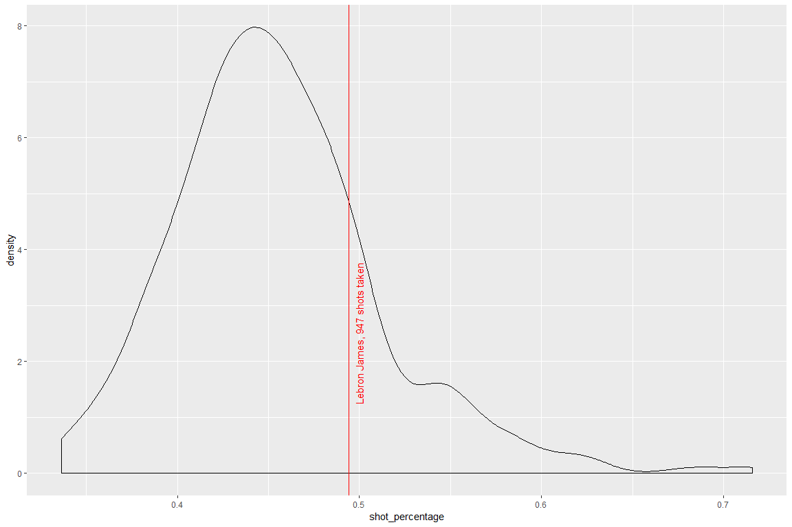
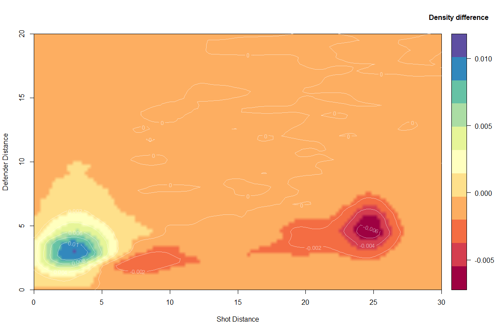
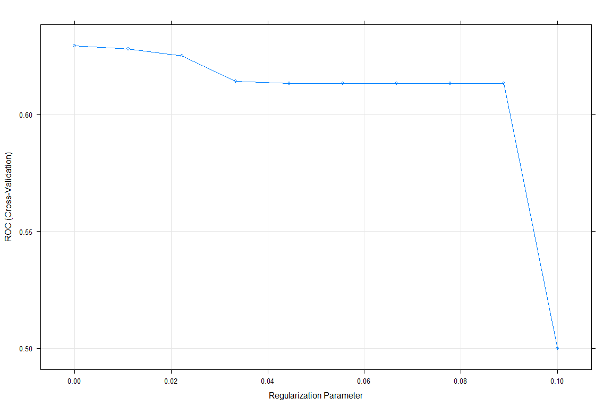
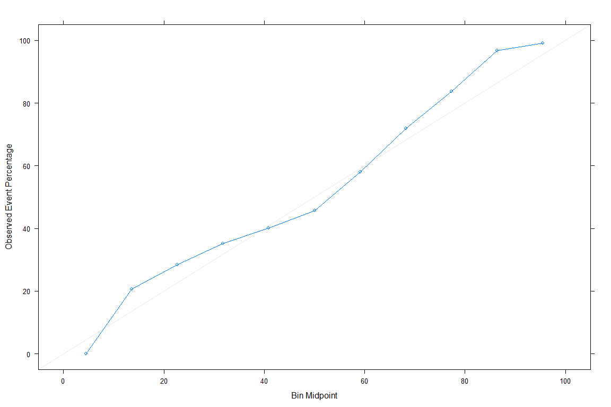

Predicting NBA shots
================

Overview
========

Given the stochastic nature of basketball shots -- a given shot that was succesful may not be succesful again when repeated under the exact same match conditions, classifying NBA shots proves rather difficult. The model has particular difficulty to identify succesful shots.

TO DO

1.  Enlarge feature space
    -   Group data along the distances of the shot and the closest defender
    -   Find players that outperform their peers in a given shot group
2.  Refit Logistic Regression model plus MARS and Random Forrests

Introduction
============

In this notebook, I classify basketball shots as succesful or unsuccesful shots. Specifically, we'll look at all the basketball shots made during the 2014-2015 NBA season scraped from the NBA's API and provided on kaggle [(https://www.kaggle.com/dansbecker/nba-shot-logs/home)](https://www.kaggle.com/dansbecker/nba-shot-logs/home).

Set up
======

``` r
# clear workspace
remove(list = ls())
# clear console
cat("\014")

library(caret)
library(tidyverse)
library(skimr)
library(ggplot2)
library(tictoc)
library(corrplot)
library(pROC)
# for density plots
library(viridis) 
library(rpart.plot)
library(mlbench)
library(rgl)
library(MASS)
library(plot3D)

path_project <- "C:/Users/Mats Ole/Desktop/predicting_nba_shots/"
path_rel_data <- "data_input/"
name_data <- "shot_logs.csv"
```

Data cleaning
=============

First, let's clean and rename the data.

``` r
df_raw <- read_csv(paste0(path_project, path_rel_data, name_data))

df_clean <- df_raw %>%
  transmute(game_id = as.factor(GAME_ID),
            matchup = as.factor(MATCHUP),
            home_game = case_when(LOCATION == "H" ~ TRUE,
                                  LOCATION == "A" ~ FALSE),
            win = case_when(W == "W" ~ TRUE,
                           W == "L" ~ FALSE),
            final_margin = abs(FINAL_MARGIN),
            shot_number = SHOT_NUMBER,
            period = PERIOD,
            game_clock = as.numeric(GAME_CLOCK),
            shot_clock = SHOT_CLOCK,
            dribbles = DRIBBLES,
            touch_time = TOUCH_TIME,
            shot_dist = SHOT_DIST,
            pts_type = as.factor(PTS_TYPE),
            shot_result = as.factor(SHOT_RESULT),
            closest_defender_name = as.factor(CLOSEST_DEFENDER),
            closest_defender_id = CLOSEST_DEFENDER_PLAYER_ID,
            closest_defender_dist = CLOSE_DEF_DIST,
            pts = PTS,
            player_name = as.factor(player_name),
            player_id = as.factor(player_id)
            ) %>% 
  dplyr::select(shot_result, everything())
```

Inspecting the data, we find that a few observations have missing shot clock values. To keep things simple and given how few observations are concerned, we'll drop them.

``` r
df_clean <- 
  df_clean %>% drop_na()
```

Data exploration
================

Overall shot percentage
-----------------------

45.6% of the shots are succesful.

``` r
mean(df_clean$shot_result == "made")
```

    ## [1] 0.4561558

``` r
options(scipen=999)
skim_with(numeric = list(hist = NULL))
kable(skim(df_clean))
```

    ## Skim summary statistics  
    ##  n obs: 122502    
    ##  n variables: 20    
    ## 
    ## Variable type: factor
    ## 
    ##        variable           missing    complete      n       n_unique                   top_counts                    ordered 
    ## -----------------------  ---------  ----------  --------  ----------  -------------------------------------------  ---------
    ##  closest_defender_name       0        122502     122502      473        Iba: 802, Jor: 786, Gre: 737, Gas: 716       FALSE  
    ##         game_id              0        122502     122502      896        214: 191, 214: 187, 214: 183, 214: 181       FALSE  
    ##         matchup              0        122502     122502      1792         FEB: 102, NOV: 99, DEC: 97, JAN: 97        FALSE  
    ##        player_id             0        122502     122502      281       200: 1010, 201: 1006, 101: 1004, 202: 953     FALSE  
    ##       player_name            0        122502     122502      281       lam: 1010, jam: 1006, mnt: 1004, kla: 953     FALSE  
    ##        pts_type              0        122502     122502       2                2: 90852, 3: 31650, NA: 0             FALSE  
    ##       shot_result            0        122502     122502       2              mis: 66622, mad: 55880, NA: 0           FALSE  
    ## 
    ## Variable type: integer
    ## 
    ##       variable          missing    complete      n         mean          sd       p0      p25       p50       p75       p100       hist   
    ## ---------------------  ---------  ----------  --------  -----------  ----------  -----  --------  --------  --------  --------  ----------
    ##  closest_defender_id       0        122502     122502    159120.43    78689.68    708    200745    201949    203079    530027    <U+2582><U+2581><U+2581><U+2587><U+2581><U+2581><U+2581><U+2581> 
    ##       dribbles             0        122502     122502      1.99         3.41       0       0         1         2         32      <U+2587><U+2581><U+2581><U+2581><U+2581><U+2581><U+2581><U+2581> 
    ##     final_margin           0        122502     122502      10.78        7.81       1       5         9         15        53      <U+2587><U+2586><U+2583><U+2582><U+2581><U+2581><U+2581><U+2581> 
    ##        period              0        122502     122502      2.47         1.14       1       1         2         3         7       <U+2587><U+2587><U+2587><U+2587><U+2581><U+2581><U+2581><U+2581> 
    ##          pts               0        122502     122502      1.01         1.13       0       0         0         2         3       <U+2587><U+2581><U+2581><U+2581><U+2581><U+2586><U+2581><U+2582> 
    ##      shot_number           0        122502     122502      6.48         4.68       1       3         5         9         37      <U+2587><U+2585><U+2582><U+2581><U+2581><U+2581><U+2581><U+2581> 
    ## 
    ## Variable type: logical
    ## 
    ##  variable     missing    complete      n       mean                count             
    ## -----------  ---------  ----------  --------  ------  -------------------------------
    ##  home_game       0        122502     122502    0.5     FAL: 61315, TRU: 61187, NA: 0 
    ##     win          0        122502     122502    0.51    TRU: 62149, FAL: 60353, NA: 0 
    ## 
    ## Variable type: numeric
    ## 
    ##        variable           missing    complete      n         mean         sd         p0       p25      p50      p75     p100  
    ## -----------------------  ---------  ----------  --------  ----------  ----------  --------  -------  -------  -------  -------
    ##  closest_defender_dist       0        122502     122502      4.12        2.75        0        2.3      3.7      5.3     53.2  
    ##       game_clock             0        122502     122502    21664.11    12121.46      60      11220    21720    32160    43200 
    ##       shot_clock             0        122502     122502     12.45        5.76        0        8.2     12.3     16.67     24   
    ##        shot_dist             0        122502     122502     13.44        8.78        0        4.7     13.4     22.4     43.5  
    ##       touch_time             0        122502     122502      2.75        2.96      -100.5     0.9      1.6      3.7     24.9

Most frequent shots are short-range 2-points shots or long-range 3-point shots.
-------------------------------------------------------------------------------

``` r
# Set display ranges to zoom in on areas where vast majority of data points lie 
display_range_x <- c(0, 30)
display_range_y <- c(0, 20)

ggplot(df_clean, 
       aes(x = shot_dist, 
           y = closest_defender_dist)
       ) +
  stat_density2d(aes(fill = ..density..), 
                 contour = F, geom = 'tile'
                 ) +
  scale_fill_viridis() + 
  ggtitle("Density distribution of all shots") +
  coord_cartesian(xlim = display_range_x, 
                  ylim = display_range_y
                  ) +
  geom_vline(xintercept = 22, 
             linetype = "dotted", 
             colour = "red") +
  geom_vline(xintercept = 23.75, 
             linetype = "dotted", 
             colour = "red") +
  geom_vline(xintercept = 23.75, 
             linetype = "dotted", 
             colour = "red") +
  annotate("text", 
           x = 21, 
           y = 15, 
           label = paste("Corner 3 points"), 
           size = 4, 
           angle = 90, 
           colour = "red") +
  annotate("text", 
           x = 24.75, 
           y = 15, 
           label = paste("Normal 3 points"), 
           size = 4, 
           angle = 90, 
           colour = "red")
```



Short-range shots tend to be more succesful than long-range shots
-----------------------------------------------------------------

Below, I plot the difference in density between succesful and unsuccesful shots in the shot-distance-closest-defender-space. The graph suggests that shot distance and defender distance will play important rolls in classifying a shot succesful or unsuccesful.

``` r
df_made <- filter(df_clean, shot_result == "made")
df_missed <- filter(df_clean, shot_result == "missed")

n_grid <- 200

common_limits <- 
  c(range(df_clean$shot_dist), 
    range(df_clean$closest_defender_dist)
    )

kde_p <- kde2d(df_made$shot_dist,
               df_made$closest_defender_dist,
               n = n_grid, 
               lims = common_limits)

kde_n <- kde2d(df_missed$shot_dist,
               df_missed$closest_defender_dist,
               n = n_grid, 
               lims = common_limits)

z <- kde_p$z - kde_n$z

image2D(x = kde_p$x, 
        y = kde_p$y, 
        z,
        col = RColorBrewer::brewer.pal(11,"Spectral"),
        xlab = "Shot Distance",
        ylab = "Defender Distance",
        clab = "Density difference",
        shade = 0, 
        rasterImage = TRUE, 
        xlim = display_range_x, 
        ylim = display_range_y,
        contour = list(col = "white", 
                       labcex = 0.8, 
                       lwd = 1, 
                       alpha = 0.5)
        )
```



Model fitting preparation
=========================

Data pre-processing
-------------------

We'll do a typical 80/20 training-test split, making sure that proportions of succesful shots are similar across the two samples.

``` r
# stratified random split of the data
df <- df_clean # only look at part of the data for exploratory analysis
in_training <- createDataPartition(y = df$shot_result, p = 0.8, list = FALSE)
df_train <- df[in_training, ]
df_test <- df[-in_training,]
```

Parameter tuning options
------------------------

When fitting the models, we'll use via 3-fold cross-validation to tune the models and to get a first approximation to their out-of-training-sample performance. Since we are trying to classify shots as succesful or unsuccesful, we'll use the area under the receiver-operator-curve (ROC) as objective function to be maximised. Carets option to center and scales predictors will also be used.

``` r
# set up
fitted_models <- list()
model_predictions <- list()
fit_control <- trainControl(method = "cv", 
                            number = 3, 
                            classProbs = TRUE,
                            summaryFunction = twoClassSummary)
pre_proc_options <- c("center", "scale")
optimisation_metric <- "ROC"

grids <- list()
model_specs <- list()
```

Custom plotting functions to evluate model performance
------------------------------------------------------

``` r
make_calibration_plot <- function(df, fitted_model) {
  df$probs <- predict.train(fitted_model, df, type = "prob")[,1]
  calibration_curve <- calibration(shot_result ~ probs, data = df)
  xyplot(calibration_curve, auto.key = list(columns = 2))
}

make_roc_plot <- function(df, fitted_model) {
  df$probs <- predict.train(fitted_model, df, type = "prob")[,2]
  roc_curve <- roc(response = df$shot_result, predictor = df$probs)
  print(auc(roc_curve))
  plot(roc_curve, legacy.axes = TRUE)
}
```

Lasso Regression
================

We'll model shot success as a (linear) function of

-   shot distance,
-   closest defender distance,
-   time on the shot clock,
-   the final margin of the game (how close the game ends up being),
-   the touch time (how long the player has the ball before he takes the shot) and
-   whether the game is a home game or not.

The effect of shot distance and closest defender distance will be modelled by second-order polynomials in order to allow effects to change non-linearly: the effect of distance may differ as distance increases. The initial meter of extra space between the shooter and defender is likely more important than an extra meter of space if the defender is already four meters away.

Additionally, we'll allow the effects of shot and defender distance to differ for two and three point shots.

``` r
model_specs$regression <- 
  shot_result ~ shot_dist*pts_type + 
  I(shot_dist^2) +
  I(shot_dist^2):pts_type + 
  closest_defender_dist*pts_type + 
  I(closest_defender_dist^2) +
  I(closest_defender_dist^2):pts_type +
  closest_defender_dist:shot_dist +
  shot_clock +
  final_margin +
  touch_time +
  dribbles +
  home_game


tic()
grids$lasso <- expand.grid(alpha = 1,lambda = 10 ^ seq(-5, -1, length = 5))
set.seed(111)
fitted_models[["lasso"]] <- train(model_specs$regression, data = df_train,
                                  method = "glmnet",
                                  metric = optimisation_metric,
                                  preProc = pre_proc_options,
                                  trControl = fit_control,
                                  tuneGrid = grids[["lasso"]]
                                  )
model_predictions[["lasso"]] <- predict.train(fitted_models[["lasso"]], df_test)
toc()
```

    ## 33.5 sec elapsed

It turns out that the best penalty value is the zero-penalty, indicating that the regression model is not over-fitting.

``` r
plot(fitted_models$lasso)
```



The model has an accuracy of 61%. It is better at identifying at misses, of which it correctly identifies 76% (specificity), whereas only 43% of made shots are correctly identified (sensitivity).

``` r
confusionMatrix(model_predictions$lasso,df_test$shot_result, positive = "made")
```

    ## Confusion Matrix and Statistics
    ## 
    ##           Reference
    ## Prediction  made missed
    ##     made    4379   2639
    ##     missed  6797  10685
    ##                                                
    ##                Accuracy : 0.6149               
    ##                  95% CI : (0.6087, 0.621)      
    ##     No Information Rate : 0.5438               
    ##     P-Value [Acc > NIR] : < 0.00000000000000022
    ##                                                
    ##                   Kappa : 0.1997               
    ##  Mcnemar's Test P-Value : < 0.00000000000000022
    ##                                                
    ##             Sensitivity : 0.3918               
    ##             Specificity : 0.8019               
    ##          Pos Pred Value : 0.6240               
    ##          Neg Pred Value : 0.6112               
    ##              Prevalence : 0.4562               
    ##          Detection Rate : 0.1787               
    ##    Detection Prevalence : 0.2864               
    ##       Balanced Accuracy : 0.5969               
    ##                                                
    ##        'Positive' Class : made                 
    ## 

As expected, the most important variables are the distance of the shot and the distance to the closest defender.

``` r
varImp(fitted_models$lasso)
```

    ## glmnet variable importance
    ## 
    ##                                       Overall
    ## I(shot_dist^2)                       100.0000
    ## shot_dist                             97.9739
    ## shot_dist:closest_defender_dist       85.9761
    ## closest_defender_dist                 81.5330
    ## pts_type3:I(shot_dist^2)              33.9897
    ## pts_type3:closest_defender_dist       23.3626
    ## pts_type3                              9.5544
    ## touch_time                             9.3823
    ## pts_type3:I(closest_defender_dist^2)   7.6114
    ## shot_clock                             6.2745
    ## dribbles                               3.7801
    ## I(closest_defender_dist^2)             3.1361
    ## home_gameTRUE                          1.4869
    ## final_margin                           0.3175
    ## shot_dist:pts_type3                    0.0000

``` r
coef(fitted_models$lasso$finalModel, fitted_models$lasso$bestTune$lambda)
```

    ## 16 x 1 sparse Matrix of class "dgCMatrix"
    ##                                                 1
    ## (Intercept)                           0.165367213
    ## shot_dist                             1.145667267
    ## pts_type3                            -0.111725813
    ## I(shot_dist^2)                       -1.169359095
    ## closest_defender_dist                -0.953413134
    ## I(closest_defender_dist^2)            0.036672577
    ## shot_clock                           -0.073371434
    ## final_margin                         -0.003712905
    ## touch_time                            0.109712481
    ## dribbles                             -0.044203010
    ## home_gameTRUE                        -0.017387762
    ## shot_dist:pts_type3                   .          
    ## pts_type3:I(shot_dist^2)              0.397461796
    ## pts_type3:closest_defender_dist      -0.273193228
    ## pts_type3:I(closest_defender_dist^2)  0.089005058
    ## shot_dist:closest_defender_dist       1.005369700

Comparing the predictions of the model with the test data, the achieved ROC is 0.6275.

``` r
make_roc_plot(df_test, fitted_models$lasso)
```

    ## Area under the curve: 0.632



Performance of non-parametric methods
=====================================

It turns out, that the performance of non-parametric methods such as MARS or random forrests, is not siginificantly better than the base model above. To improve performance, let's create additional features.

Generating additional features -- leveraging individual player info
===================================================================

The low ROC of the model is largely due to its failure to correclty identify succesful shots, as indicated by the low sensitivity of the model. The strategy to remedy this will be to enlarge the feature space. Specificly, we will sort shots into groups within the shot-distance-closest-defender-distance space and try to identify players, which score better than the rest in a given distance group. This should improve the result more than simply adding individual player dummies, as different players have different "sweet spots" conditions on court under which they excel in comparison to their peers.

The enlarged feature space should also boost the performance of non-parametric models like MARS and random forrets.

TO DO
=====

1.  Generate dummies for different areas in shot-distance-closest-defender-distance space
2.  Fit simple OLS model and look at residuals to identify players that outperform the rest
3.  Refit Logistic Lasso, RF and MARS models
