Predicting NBA shots
================

Introduction
============

In this notebook, regression and machine learning techniques are used to predict whether a basketball shot is succesful (hits the basket and scores a point) or not. SPecifically, we'll look at all the basketball shots made during the 2014-2015 NBA season scraped from the NBA's API and provided on kaggle [(https://www.kaggle.com/dansbecker/nba-shot-logs/home)](https://www.kaggle.com/dansbecker/nba-shot-logs/home).

Set up
======

``` r
# Code which explores the NBA shot log data
# clear workspace
remove(list = ls())
# clear console
cat("\014")

# load packages
library(caret)
library(tidyverse)
library(skimr)
library(ggplot2)
library(tictoc)
library(corrplot)
library(pROC)
library(viridis) # for density plot
library(rpart.plot)

path_project <- "C:/Users/Mats Ole/Desktop/predicting_nba_shots/"
path_rel_data <- "data_input/"
name_data <- "shot_logs.csv"
```

Data cleaning
=============

First, let's clean and rename the data.

``` r
df_raw <- read_csv(paste0(path_project, path_rel_data, name_data))

df_clean <- df_raw %>%
  transmute(game_id = as.factor(GAME_ID),
            matchup = as.factor(MATCHUP),
            home_game = case_when(LOCATION == "H" ~ TRUE,
                                  LOCATION == "A" ~ FALSE),
            win = case_when(W == "W" ~ TRUE,
                           W == "L" ~ FALSE),
            final_margin = abs(FINAL_MARGIN),
            shot_number = SHOT_NUMBER,
            period = PERIOD,
            game_clock = as.numeric(GAME_CLOCK),
            shot_clock = SHOT_CLOCK,
            dribbles = DRIBBLES,
            touch_time = TOUCH_TIME,
            shot_dist = SHOT_DIST,
            pts_type = as.factor(PTS_TYPE),
            shot_result = as.factor(SHOT_RESULT),
            closest_defender = as.factor(CLOSEST_DEFENDER),
            closest_defender_id = CLOSEST_DEFENDER_PLAYER_ID,
            closest_defender_dist = CLOSE_DEF_DIST,
            pts = PTS,
            player_name = as.factor(player_name),
            player_id = player_id) %>%
  drop_na() %>% # Here we're dropping about 6k or 0.4% of the observations.
  select(shot_result, everything())
```

Data exploration
================

Summary stats
-------------

``` r
kable(skim(df_clean))
```

Skim summary statistics
n obs: 122502
n variables: 20

Variable type: factor

|      variable     | missing | complete |    n   | n\_unique |                top\_counts                | ordered |
|:-----------------:|:-------:|:--------:|:------:|:---------:|:-----------------------------------------:|:-------:|
| closest\_defender |    0    |  122502  | 122502 |    473    |   Iba: 802, Jor: 786, Gre: 737, Gas: 716  |  FALSE  |
|      game\_id     |    0    |  122502  | 122502 |    896    |   214: 191, 214: 187, 214: 183, 214: 181  |  FALSE  |
|      matchup      |    0    |  122502  | 122502 |    1792   |    FEB: 102, NOV: 99, DEC: 97, JAN: 97    |  FALSE  |
|    player\_name   |    0    |  122502  | 122502 |    281    | lam: 1010, jam: 1006, mnt: 1004, kla: 953 |  FALSE  |
|     pts\_type     |    0    |  122502  | 122502 |     2     |         2: 90852, 3: 31650, NA: 0         |  FALSE  |
|    shot\_result   |    0    |  122502  | 122502 |     2     |       mis: 66622, mad: 55880, NA: 0       |  FALSE  |

Variable type: integer

|        variable       | missing | complete |    n   |    mean   |    sd    |  p0 |  p25  |  p50  |  p75  |  p100  |                               hist                               |
|:---------------------:|:-------:|:--------:|:------:|:---------:|:--------:|:---:|:-----:|:-----:|:-----:|:------:|:----------------------------------------------------------------:|
| closest\_defender\_id |    0    |  122502  | 122502 | 159120.43 | 78689.68 | 708 | 2e+05 | 2e+05 | 2e+05 | 530027 | <U+2582><U+2581><U+2581><U+2587><U+2581><U+2581><U+2581><U+2581> |
|        dribbles       |    0    |  122502  | 122502 |    1.99   |   3.41   |  0  |   0   |   1   |   2   |   32   | <U+2587><U+2581><U+2581><U+2581><U+2581><U+2581><U+2581><U+2581> |
|     final\_margin     |    0    |  122502  | 122502 |   10.78   |   7.81   |  1  |   5   |   9   |   15  |   53   | <U+2587><U+2586><U+2583><U+2582><U+2581><U+2581><U+2581><U+2581> |
|         period        |    0    |  122502  | 122502 |    2.47   |   1.14   |  1  |   1   |   2   |   3   |    7   | <U+2587><U+2587><U+2587><U+2587><U+2581><U+2581><U+2581><U+2581> |
|       player\_id      |    0    |  122502  | 122502 | 157334.91 | 79304.95 | 708 | 1e+05 | 2e+05 | 2e+05 |  2e+05 | <U+2582><U+2581><U+2581><U+2581><U+2581><U+2581><U+2581><U+2587> |
|          pts          |    0    |  122502  | 122502 |    1.01   |   1.13   |  0  |   0   |   0   |   2   |    3   | <U+2587><U+2581><U+2581><U+2581><U+2581><U+2586><U+2581><U+2582> |
|      shot\_number     |    0    |  122502  | 122502 |    6.48   |   4.68   |  1  |   3   |   5   |   9   |   37   | <U+2587><U+2585><U+2582><U+2581><U+2581><U+2581><U+2581><U+2581> |

Variable type: logical

|  variable  | missing | complete |    n   | mean |             count             |
|:----------:|:-------:|:--------:|:------:|:----:|:-----------------------------:|
| home\_game |    0    |  122502  | 122502 |  0.5 | FAL: 61315, TRU: 61187, NA: 0 |
|     win    |    0    |  122502  | 122502 | 0.51 | TRU: 62149, FAL: 60353, NA: 0 |

Variable type: numeric

|           variable          |  missing | complete |    n   |   mean   |    sd    |   p0   |  p25  |  p50  |  p75  |  p100 |                               hist                               |
|:---------------------------:|:--------:|:--------:|:------:|:--------:|:--------:|:------:|:-----:|:-----:|:-----:|:-----:|:----------------------------------------------------------------:|
|   closest\_defender\_dist   |     0    |  122502  | 122502 |   4.12   |   2.75   |    0   |  2.3  |  3.7  |  5.3  |  53.2 | <U+2587><U+2581><U+2581><U+2581><U+2581><U+2581><U+2581><U+2581> |
|         game\_clock         |     0    |  122502  | 122502 | 21664.11 | 12121.46 |   60   | 11220 | 21720 | 32160 | 43200 | <U+2587><U+2587><U+2587><U+2587><U+2587><U+2587><U+2587><U+2587> |
|         shot\_clock         |     0    |  122502  | 122502 |   12.45  |   5.76   |    0   |  8.2  |  12.3 | 16.67 |   24  | <U+2582><U+2585><U+2586><U+2587><U+2587><U+2586><U+2585><U+2583> |
|          shot\_dist         |     0    |  122502  | 122502 |   13.44  |   8.78   |    0   |  4.7  |  13.4 |  22.4 |  43.5 | <U+2587><U+2585><U+2583><U+2585><U+2587><U+2581><U+2581><U+2581> |
|         touch\_time         |     0    |  122502  | 122502 |   2.75   |   2.96   | -100.5 |  0.9  |  1.6  |  3.7  |  24.9 | <U+2581><U+2581><U+2581><U+2581><U+2581><U+2581><U+2587><U+2581> |
| \#\# Overall shot percentag |     e    |          |        |          |          |        |       |       |       |       |                                                                  |
|  45.6% of the shots are su  | ccesful. |          |        |          |          |        |       |       |       |       |                                                                  |

``` r
mean(df_clean$shot_result == "made")
```

    ## [1] 0.4561558

Most frequent shots are short-range 2-points shots or 3-point shots.
--------------------------------------------------------------------

``` r
ggplot(df_clean %>% 
         filter(shot_result == "made"), aes(x = shot_dist, 
                                            y = closest_defender_dist)) +
  stat_density2d(aes(fill = ..density..), contour = F, geom = 'tile') +
  scale_fill_viridis() + ggtitle("Density distribution of succesful shots") +
  coord_cartesian(xlim = c(0, 30), ylim = c(0, 20)) +
  geom_vline(xintercept = 22, linetype = "dotted", colour = "red") +
  geom_vline(xintercept = 23.75, linetype = "dotted", colour = "red") +
  geom_vline(xintercept = 23.75, linetype = "dotted", colour = "red") +
  annotate("text", x = 21, y = 15, 
           label = paste("Corner 3 points"), 
           size = 4, angle = 90, colour = "red") +
  annotate("text", x = 24.75, y = 15, 
           label=paste("Normal 3 points"), 
           size = 4, angle = 90, colour = "red")
```


``` r
ggplot(df_clean %>% filter(shot_result == "missed"), aes(x = shot_dist, y = closest_defender_dist)) +
  stat_density2d(aes(fill = ..density..), contour = F, geom = 'tile') +
  scale_fill_viridis() + ggtitle("Density distribution of unsuccesful shots") +
  coord_cartesian(xlim = c(0, 30), ylim = c(0, 20)) +
  geom_vline(xintercept = 22, linetype = "dotted", colour = "red") +
  geom_vline(xintercept = 23.75, linetype = "dotted", colour = "red") +
  geom_vline(xintercept = 23.75, linetype = "dotted", colour = "red") +
  annotate("text", x = 21, y = 15, 
           label = paste("Corner 3 points"), 
           size = 4, angle = 90, colour = "red") +
  annotate("text", x = 24.75, y = 15, 
           label=paste("Normal 3 points"), 
           size = 4, angle = 90, colour = "red")
```

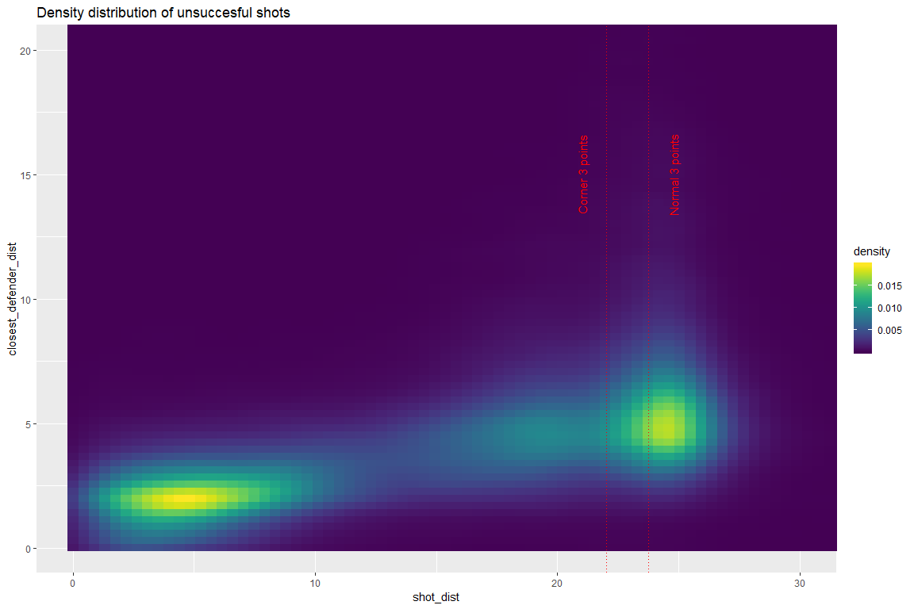

Lebron James is an above-average shooter, but there is fat tail of high-percentage shooters that exceed his shooting percentage.
--------------------------------------------------------------------------------------------------------------------------------

``` r
df_best_shooters <- 
  df_clean %>% 
  group_by(player_name) %>% 
  summarise(shot_percentage = mean(shot_result == "made"),
            number_shots_taken = n()) %>% 
  ungroup() %>% 
  filter(number_shots_taken >= 100) %>% 
  arrange(desc(shot_percentage))

ggplot(df_best_shooters,
       aes(x = shot_percentage)) +
  geom_density() +
  geom_vline(xintercept = 0.494, linetype = "solid", colour = "red") +
  annotate("text", x = 0.5, y = 2.5, 
           label = paste("Lebron James, 947 shots taken"), 
           size = 4, angle = 90, colour = "red")
```

 \#\# The players with the highest shooting percentages tend to play on positions that are close to the basket.

``` r
head(df_best_shooters)
```

    ## # A tibble: 6 x 3
    ##   player_name    shot_percentage number_shots_taken
    ##   <fct>                    <dbl>              <int>
    ## 1 deandre jordan           0.716                387
    ## 2 tyson chandler           0.684                332
    ## 3 rudy gobert              0.625                261
    ## 4 james johnson            0.622                304
    ## 5 ed davis                 0.617                290
    ## 6 alexis ajinca            0.595                205

``` r
df_best_defenders <- 
  df_clean %>% 
  group_by(closest_defender) %>% 
  summarise(shot_percentage = mean(shot_result == "made"),
            number_shots_defended = n()) %>% 
  ungroup() %>% 
  filter(number_shots_defended >= 100) %>% 
  arrange(shot_percentage)
```

When you are defended by Lebron James, your shooting percentage tends to be below average.
------------------------------------------------------------------------------------------

``` r
ggplot(df_best_defenders,
       aes(x = shot_percentage)) +
  geom_density() +
  geom_vline(xintercept = 0.44, linetype = "solid", colour = "red") +
  annotate("text", x = 0.45, y = 3, 
           label = paste("Lebron James, 325 shots defended"), 
           size = 4, angle = 90, colour = "red")
```

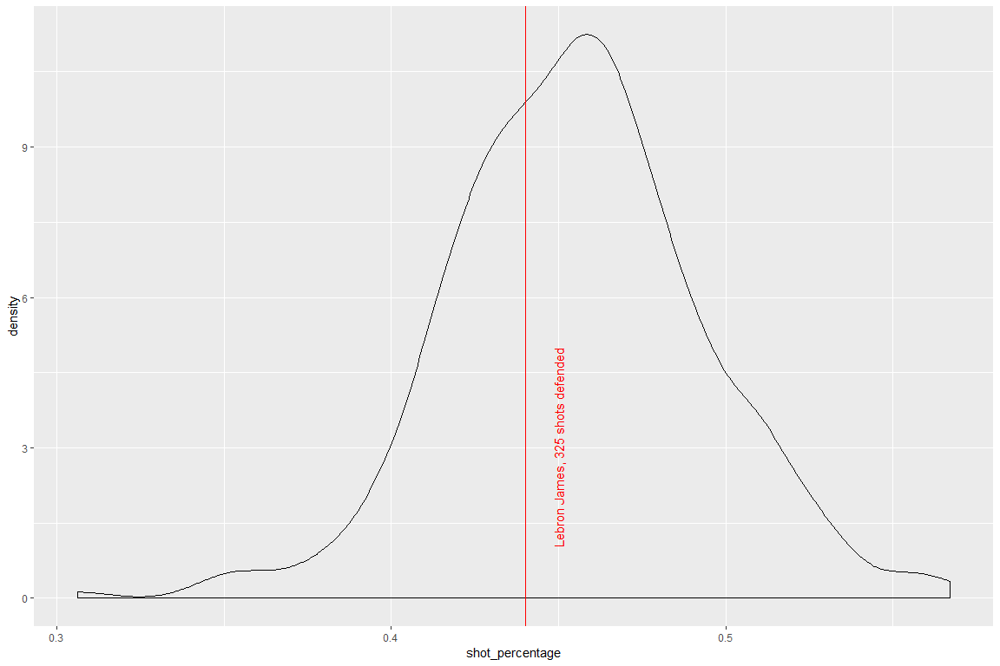

``` r
head(df_best_defenders)
```

    ## # A tibble: 6 x 3
    ##   closest_defender   shot_percentage number_shots_defended
    ##   <fct>                        <dbl>                 <int>
    ## 1 Miller, Andre                0.306                   160
    ## 2 Galloway, Langston           0.346                   179
    ## 3 Gee, Alonzo                  0.349                   106
    ## 4 Millsap, Elijah              0.354                   130
    ## 5 Allen, Tony                  0.36                    300
    ## 6 Mills, Patty                 0.361                   108

Correlations among predictors
-----------------------------

There are some expected correlations among the predictors:

-   As shot distance increases, so does the space a defender gives the shooting player.
-   Number of dribbles taken by the player who makes the shots and the amount of time the player has had the ball in his hands are naturally highly correlated.
-   The number of the shot and the number of the game period/quarter are also expected to be correlated.

``` r
correlations <- cor(df_clean %>% select_if(is.numeric))
corrplot(correlations, order = "hclust")
```

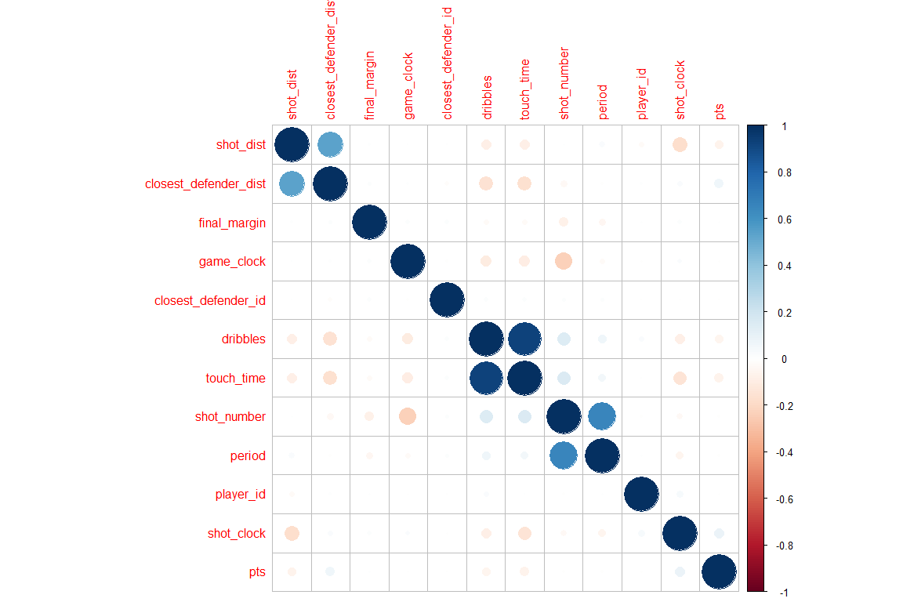

Model fitting preparation
=========================

Data pre-processing
-------------------

Due to a combination of constraints on computational power and size of the dataset, we'll only use 20 percent of the data as training data and the other 80% as testing data.

``` r
# stratified random split of the data
df <- df_clean # only look at part of the data for exploratory analysis
in_training <- createDataPartition(y = df$shot_result, p = 0.2, list = FALSE)
df_train <- df[in_training, ]
df_test <- df[-in_training,]
```

Parameter tuning options
------------------------

We'll fit the models via 10-fold cross-validation. Since the problem is one of classification, we'll use the area under the receiver-operator-curve (ROC) as objective function to be maximised.

``` r
# set up
fitted_models <- list()
model_predictions <- list()
fit_control <- trainControl(method = "cv", 
                            number = 10, 
                            classProbs = TRUE,
                            summaryFunction = twoClassSummary)
pre_proc_options <- c("center", "scale")
optimisation_metric <- "ROC"

grids <- list()
model_specs <- list()
```

Custom plotting functions to evluate model performance
------------------------------------------------------

``` r
make_calibration_plot <- function(df, fitted_model) {
  df$probs <- predict.train(fitted_model, df, type = "prob")[,1]
  calibration_curve <- calibration(shot_result ~ probs, data = df)
  xyplot(calibration_curve, auto.key = list(columns = 2))
}

make_roc_plot <- function(df, fitted_model) {
  df$probs <- predict.train(fitted_model, df, type = "prob")[,2]
  roc_curve <- roc(response = df$shot_result, predictor = df$probs)
  print(auc(roc_curve))
  plot(roc_curve, legacy.axes = TRUE)
}
```

Lasso Regression
================

We'll model shot success as a (linear) function of

-   shot distance,
-   closest defender distance,
-   time on the shot clock,
-   the final margin of the game (how close the game ends up being),
-   the touch time (how long the player has the ball before he takes the shot) and
-   whether the game is a home game or not.

The effect of shot distance and closest defender distance will be modelled by second-order polynomials in order to allow effects to change non-linearly: the effect of distance may differ as distance increases. The initial meter of extra space between the shooter and defender is likely more important than an extra meter of space if the defender is already four meters away.

Additionally, we'll allow the effects of shot and defender distance to differ for two and three point shots.

``` r
model_specs$regression <- shot_result ~ shot_dist*pts_type + 
                                I(shot_dist^2):pts_type + 
                                closest_defender_dist*pts_type + 
                                I(closest_defender_dist^2):pts_type + 
                                shot_clock +
                                final_margin +
                                touch_time +
                                dribbles +
                                home_game

tic()
grids$lasso <- expand.grid(alpha = 1,lambda = seq(0, 0.1, length = 10))
set.seed(111)
fitted_models[["lasso"]] <- train(model_specs$regression, data = df_train,
                                  method = "glmnet",
                                  metric = optimisation_metric,
                                  preProc = pre_proc_options,
                                  trControl = fit_control,
                                  tuneGrid = grids[["lasso"]]
                                  )
model_predictions[["lasso"]] <- predict.train(fitted_models[["lasso"]], df_test)
toc()
```

    ## 22.29 sec elapsed

It turns out that the best penalty value is the zero-penalty, indicating that the regression model is not over-fitting.

``` r
plot(fitted_models$lasso)
```

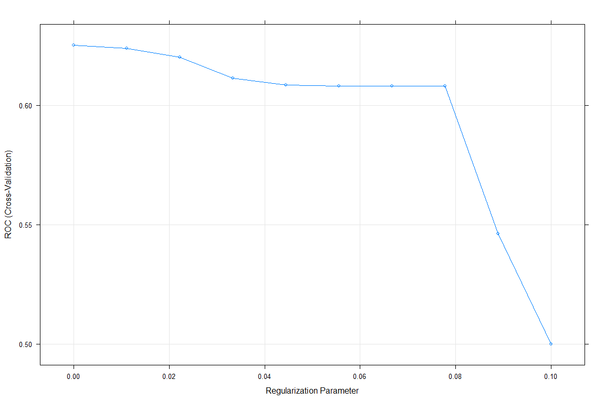

The model has an accuracy of 61%. It is better at identifying at misses, of which it correctly identifies 76% (specificity), whereas only 43% of made shots are correctly identified (sensitivity).

``` r
confusionMatrix(model_predictions$lasso,df_test$shot_result, positive = "made")
```

    ## Confusion Matrix and Statistics
    ## 
    ##           Reference
    ## Prediction  made missed
    ##     made   19555  13007
    ##     missed 25149  40290
    ##                                           
    ##                Accuracy : 0.6107          
    ##                  95% CI : (0.6076, 0.6137)
    ##     No Information Rate : 0.5438          
    ##     P-Value [Acc > NIR] : < 2.2e-16       
    ##                                           
    ##                   Kappa : 0.1977          
    ##  Mcnemar's Test P-Value : < 2.2e-16       
    ##                                           
    ##             Sensitivity : 0.4374          
    ##             Specificity : 0.7560          
    ##          Pos Pred Value : 0.6005          
    ##          Neg Pred Value : 0.6157          
    ##              Prevalence : 0.4562          
    ##          Detection Rate : 0.1995          
    ##    Detection Prevalence : 0.3323          
    ##       Balanced Accuracy : 0.5967          
    ##                                           
    ##        'Positive' Class : made            
    ## 

As expected, the most important variables are the shot and closest defender distance.

``` r
varImp(fitted_models$lasso)
```

    ## glmnet variable importance
    ## 
    ##                                      Overall
    ## shot_dist                            100.000
    ## closest_defender_dist                 48.534
    ## shot_dist:pts_type3                   44.281
    ## pts_type2:I(shot_dist^2)              32.831
    ## pts_type3:closest_defender_dist       26.951
    ## pts_type3                             14.553
    ## pts_type2:I(closest_defender_dist^2)  13.607
    ## pts_type3:I(shot_dist^2)              12.758
    ## pts_type3:I(closest_defender_dist^2)   9.841
    ## shot_clock                             7.345
    ## touch_time                             7.321
    ## home_gameTRUE                          1.552
    ## dribbles                               1.388
    ## final_margin                           0.000

``` r
coef(fitted_models$lasso$finalModel, fitted_models$lasso$bestTune$lambda)
```

    ## 15 x 1 sparse Matrix of class "dgCMatrix"
    ##                                                1
    ## (Intercept)                           0.17910566
    ## shot_dist                             1.13319473
    ## pts_type3                            -0.17371443
    ## closest_defender_dist                -0.55529095
    ## shot_clock                           -0.09277773
    ## final_margin                         -0.01030441
    ## touch_time                            0.09251163
    ## dribbles                             -0.02589063
    ## home_gameTRUE                        -0.02772923
    ## shot_dist:pts_type3                  -0.50753400
    ## pts_type2:I(shot_dist^2)             -0.37896213
    ## pts_type3:I(shot_dist^2)             -0.15356545
    ## pts_type3:closest_defender_dist       0.31293373
    ## pts_type2:I(closest_defender_dist^2)  0.16309244
    ## pts_type3:I(closest_defender_dist^2)  0.12080495

The calibration plot shows the predicted vs observed event(=success) rate over predicted event rate buckets of 10 percentage points. In this case, this shows that there are no systematic under or overpredictions.

``` r
make_calibration_plot(df_test, fitted_models$lasso)
```

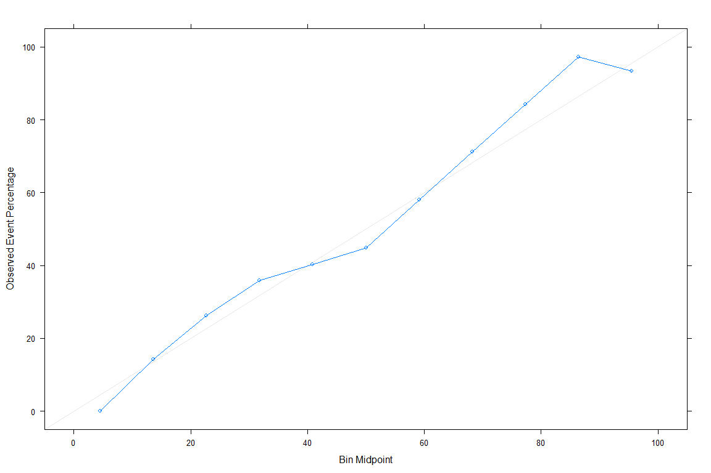

``` r
make_roc_plot(df_test, fitted_models$lasso)
```

    ## Area under the curve: 0.6302

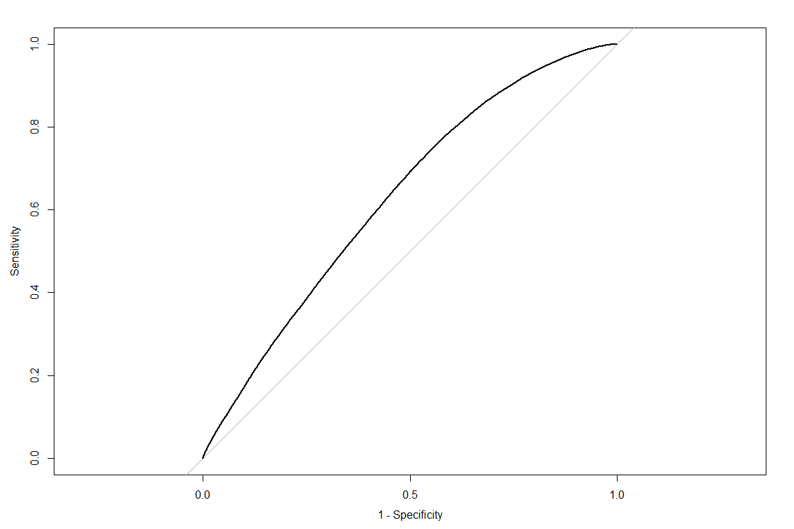

Single Decision Tree
====================

Moving on to less-parameterised methods, let's explore the results of fitting a single classification-tree model, before moving on to random forrests.

``` r
model_specs$cart <- shot_result ~ shot_dist + pts_type + 
                                closest_defender_dist + 
                                shot_clock +
                                final_margin +
                                touch_time +
                                dribbles +
                                home_game

grids$cart <- expand.grid(cp = seq(0, 0.01, length = 10))

tic()
set.seed(111)
fitted_models[["cart"]] <- train(model_specs$cart, data = df_train,
                                  method = "rpart",
                                  metric = optimisation_metric,
                                  tuneGrid = grids$cart,
                                  trControl = fit_control
                                  )
model_predictions[["cart"]] <- predict.train(fitted_models[["cart"]], df_test)
toc()
```

    ## 10.84 sec elapsed

As is typical, for low complexity parameter values, the model overfits, while for larger complexity parameter values and less complex models it underfits, resulting in an interior solution for the oprimal complexity parameter.

``` r
plot(fitted_models[["cart"]])
```

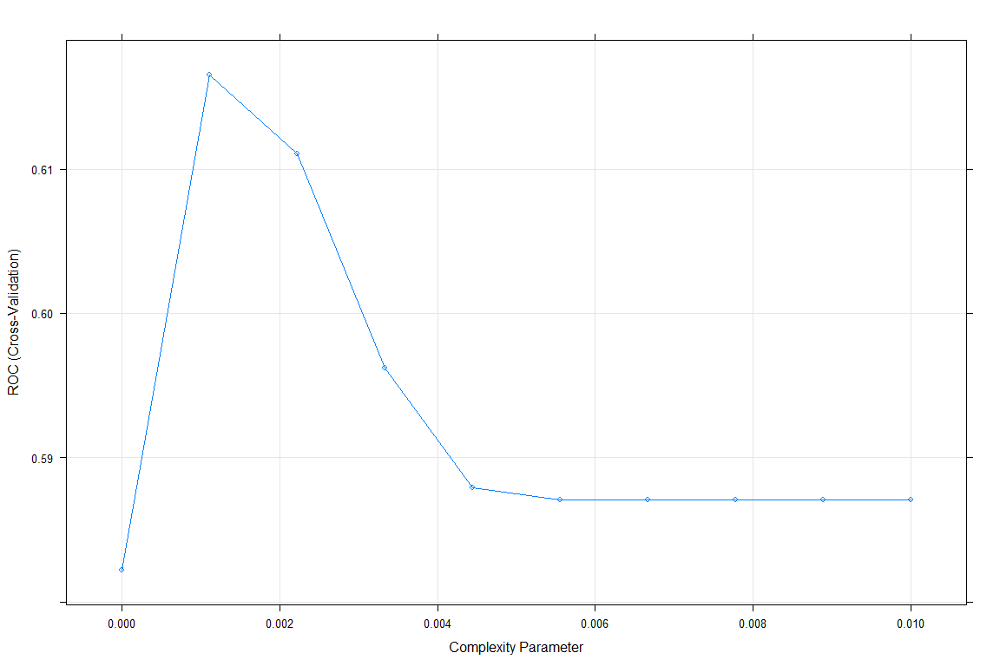

``` r
confusionMatrix(model_predictions[["cart"]],df_test$shot_result, positive = "made")
```

    ## Confusion Matrix and Statistics
    ## 
    ##           Reference
    ## Prediction  made missed
    ##     made   13119   6451
    ##     missed 31585  46846
    ##                                           
    ##                Accuracy : 0.6119          
    ##                  95% CI : (0.6088, 0.6149)
    ##     No Information Rate : 0.5438          
    ##     P-Value [Acc > NIR] : < 2.2e-16       
    ##                                           
    ##                   Kappa : 0.1806          
    ##  Mcnemar's Test P-Value : < 2.2e-16       
    ##                                           
    ##             Sensitivity : 0.2935          
    ##             Specificity : 0.8790          
    ##          Pos Pred Value : 0.6704          
    ##          Neg Pred Value : 0.5973          
    ##              Prevalence : 0.4562          
    ##          Detection Rate : 0.1339          
    ##    Detection Prevalence : 0.1997          
    ##       Balanced Accuracy : 0.5862          
    ##                                           
    ##        'Positive' Class : made            
    ## 

The calibration plot shows that the simple classification tree model, despite having a similar performance in terms of accuracy, has some severe cases of misclassification: certain pockets of the data that have a positive average-probability to be a succesful shot are predicted to have zero-likelihood of being succesful.

``` r
make_calibration_plot(df_test, fitted_models$cart)
```

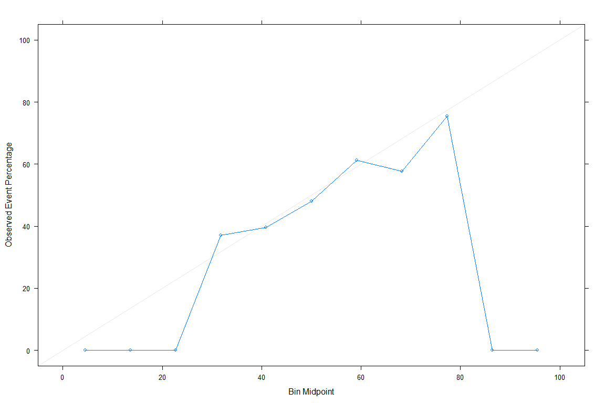

``` r
make_roc_plot(df_test, fitted_models$cart)
```

    ## Area under the curve: 0.614

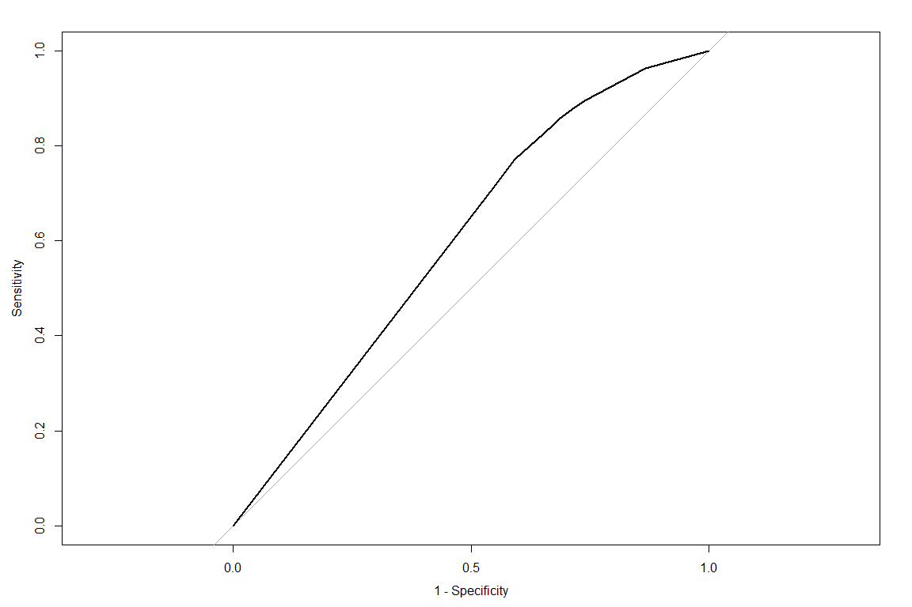

``` r
rpart.plot(fitted_models$cart$finalModel, type = 3, clip.right.lab = FALSE, branch = .3, under = TRUE)
```

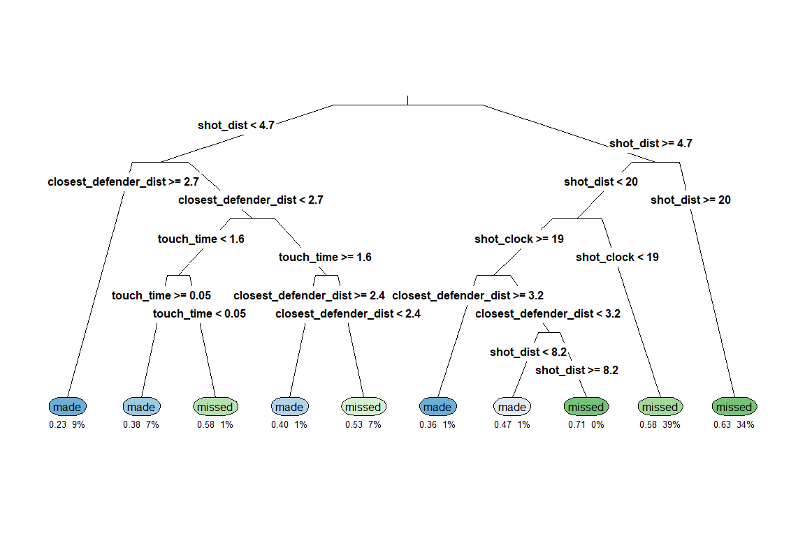

Random Forrests
===============

To improve over the performance of the single-tree model, we will now average over 500 classification trees and, for each tree, randomly sample the variables that are used to build the best decision rule at each node.

``` r
model_specs$rf <- shot_result ~ shot_dist + pts_type + 
                                closest_defender_dist + 
                                shot_clock +
                                final_margin +
                                touch_time +
                                dribbles +
                                home_game

tic()
set.seed(111)
fitted_models[["rf"]] <- train(model_specs$rf, data = df_train,
                                  method = "ranger",
                                  metric = optimisation_metric,
                               tuneLength = 3,
                               trControl = fit_control
                                  )
model_predictions[["rf"]] <- predict.train(fitted_models[["rf"]], df_test)
toc()
```

    ## 1252.25 sec elapsed

``` r
plot(fitted_models[["rf"]])
```

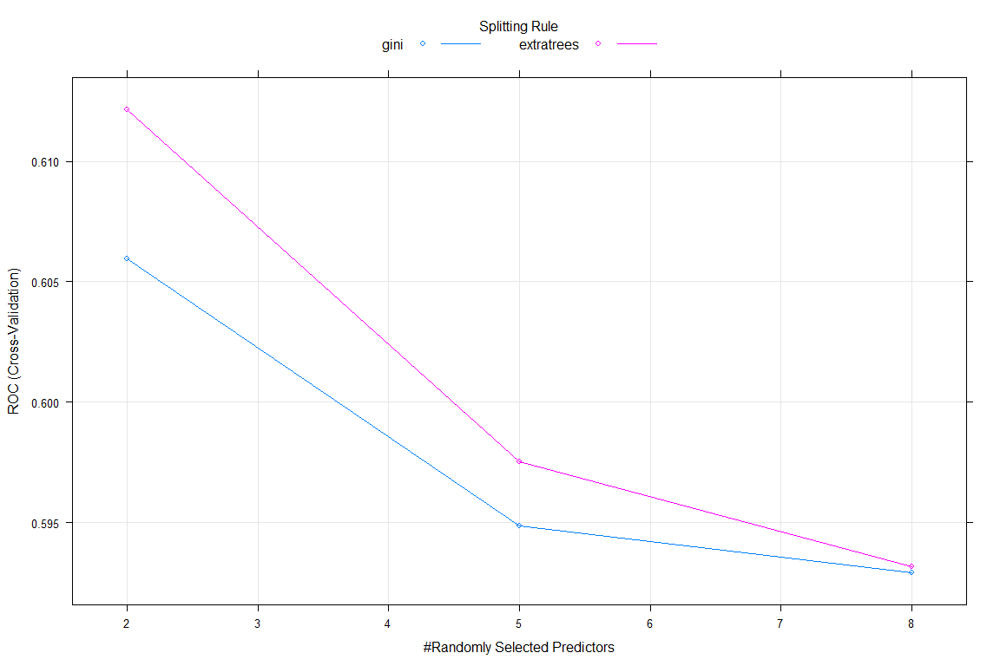

``` r
confusionMatrix(model_predictions[["rf"]],df_test$shot_result, positive = "made")
```

    ## Confusion Matrix and Statistics
    ## 
    ##           Reference
    ## Prediction  made missed
    ##     made   17630  11432
    ##     missed 27074  41865
    ##                                          
    ##                Accuracy : 0.6071         
    ##                  95% CI : (0.604, 0.6101)
    ##     No Information Rate : 0.5438         
    ##     P-Value [Acc > NIR] : < 2.2e-16      
    ##                                          
    ##                   Kappa : 0.1851         
    ##  Mcnemar's Test P-Value : < 2.2e-16      
    ##                                          
    ##             Sensitivity : 0.3944         
    ##             Specificity : 0.7855         
    ##          Pos Pred Value : 0.6066         
    ##          Neg Pred Value : 0.6073         
    ##              Prevalence : 0.4562         
    ##          Detection Rate : 0.1799         
    ##    Detection Prevalence : 0.2965         
    ##       Balanced Accuracy : 0.5899         
    ##                                          
    ##        'Positive' Class : made           
    ## 

``` r
make_calibration_plot(df_test, fitted_models$rf)
```


``` r
make_roc_plot(df_test, fitted_models$rf)
```

    ## Area under the curve: 0.6222

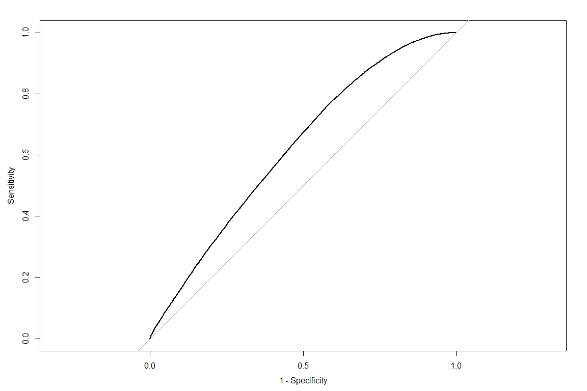

Comparing performance
=====================

Finally, we compare the models' performance across the ten cross-validation splits, to get a better understanding of the variability in the ROC numbers.

As it turns out, the logistic regression model trumps both the classification tree as well as the random forrests model. This indicates, that the underlying relationship between predictors and shot success is well covered by the specified linear structure of the logistic regression model. The comparatively low ROC numbers of all three models make more sense when taking into account the noisiness of the response: holding all factors equal, there is still a significant amount of uncertainty regarding the success of an individual basketball shot.

``` r
results <- resamples(list(LogisticLasso = fitted_models[["lasso"]],
                          ClassificationTree = fitted_models[["cart"]], 
                          RandomForrests = fitted_models[["rf"]]
                          )
                     )
summary(results)
```

    ## 
    ## Call:
    ## summary.resamples(object = results)
    ## 
    ## Models: LogisticLasso, ClassificationTree, RandomForrests 
    ## Number of resamples: 10 
    ## 
    ## ROC 
    ##                         Min.   1st Qu.    Median      Mean   3rd Qu.
    ## LogisticLasso      0.6027502 0.6170772 0.6253800 0.6251340 0.6342191
    ## ClassificationTree 0.5873163 0.5994545 0.6071627 0.6084180 0.6141607
    ## RandomForrests     0.5981538 0.6041274 0.6087921 0.6121352 0.6214851
    ##                         Max. NA's
    ## LogisticLasso      0.6433762    0
    ## ClassificationTree 0.6355717    0
    ## RandomForrests     0.6296480    0
    ## 
    ## Sens 
    ##                         Min.   1st Qu.    Median      Mean   3rd Qu.
    ## LogisticLasso      0.4028648 0.4183810 0.4297853 0.4270745 0.4372346
    ## ClassificationTree 0.2781753 0.2962880 0.3135063 0.3100416 0.3260967
    ## RandomForrests     0.3554163 0.3772361 0.3840645 0.3813528 0.3864043
    ##                         Max. NA's
    ## LogisticLasso      0.4476276    0
    ## ClassificationTree 0.3336315    0
    ## RandomForrests     0.4010743    0
    ## 
    ## Spec 
    ##                         Min.   1st Qu.    Median      Mean   3rd Qu.
    ## LogisticLasso      0.7344336 0.7531424 0.7612613 0.7598508 0.7670796
    ## ClassificationTree 0.8312078 0.8587772 0.8705436 0.8643202 0.8787538
    ## RandomForrests     0.7666917 0.7786947 0.7808624 0.7834905 0.7903529
    ##                         Max. NA's
    ## LogisticLasso      0.7779445    0
    ## ClassificationTree 0.8828829    0
    ## RandomForrests     0.7996999    0

``` r
bwplot(results)
```

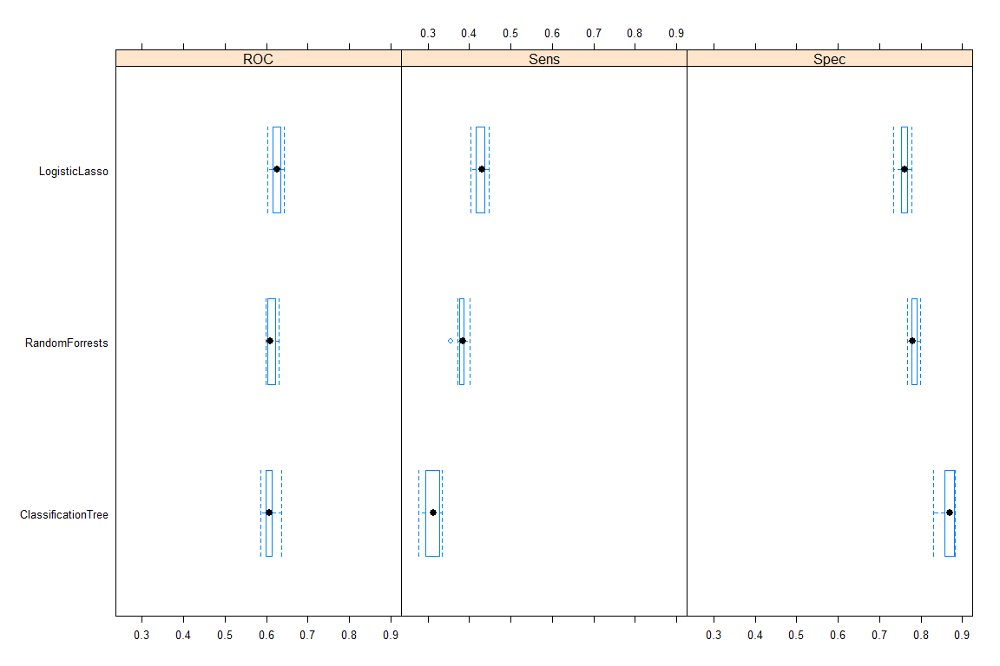
