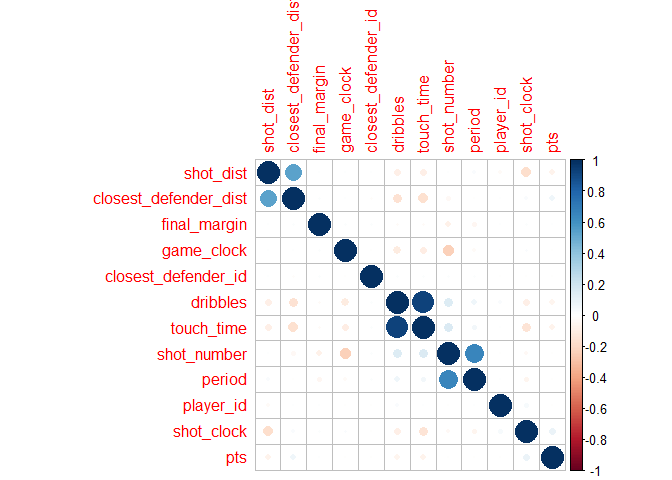
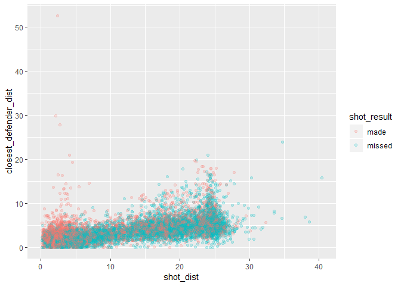
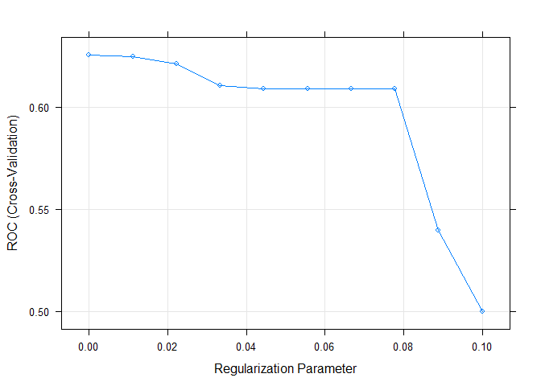
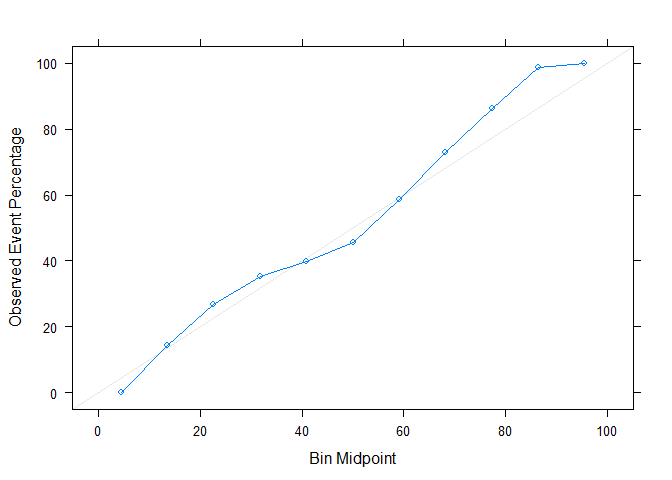
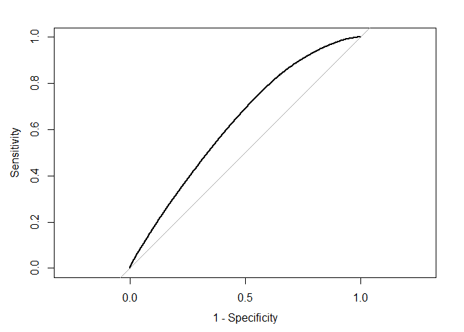
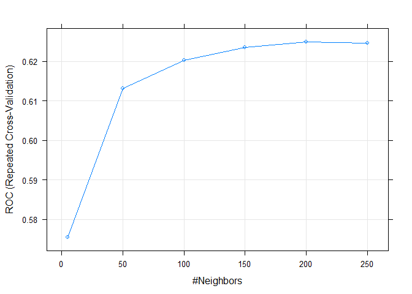
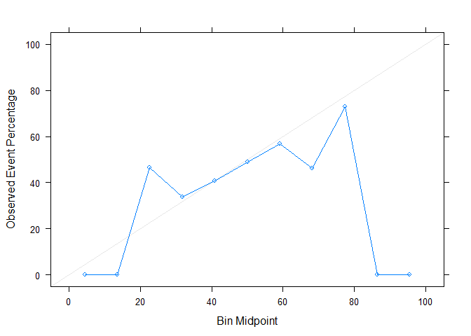
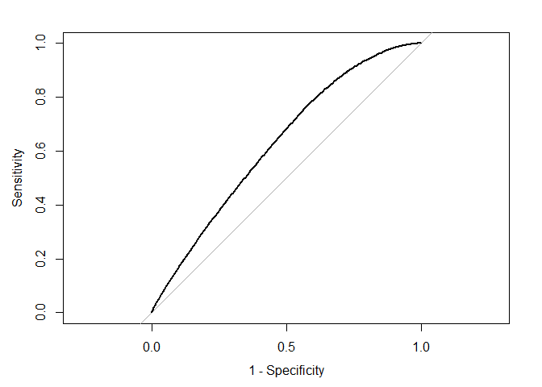

Predicting NBA shots
================

Introduction
============

In this notebook, regression and machine learning techniques are used to predict whether a basketball shot is succesful (hits the basket and scores a point) or not. SPecifically, we'll look at all the basketball shots made during the 2014-2015 NBA season scraped from the NBA's API and provided on kaggle [(https://www.kaggle.com/dansbecker/nba-shot-logs/home)](https://www.kaggle.com/dansbecker/nba-shot-logs/home).

Set up
======

``` r
# Code which explores the NBA shot log data
# clear workspace
remove(list = ls())
# clear console
cat("\014")

# load packages
library(caret)
```

    ## Loading required package: lattice

    ## Loading required package: ggplot2

``` r
library(tidyverse)
```

    ## -- Attaching packages -------------------------------------------------------------------------------------------------------------------------- tidyverse 1.2.1 --

    ## v tibble  1.4.2     v purrr   0.2.5
    ## v tidyr   0.8.1     v dplyr   0.7.6
    ## v readr   1.1.1     v stringr 1.3.1
    ## v tibble  1.4.2     v forcats 0.3.0

    ## -- Conflicts ----------------------------------------------------------------------------------------------------------------------------- tidyverse_conflicts() --
    ## x dplyr::filter() masks stats::filter()
    ## x dplyr::lag()    masks stats::lag()
    ## x purrr::lift()   masks caret::lift()

``` r
library(skimr)
library(ggplot2)
library(tictoc)
library(corrplot)
```

    ## corrplot 0.84 loaded

``` r
library(pROC)
```

    ## Type 'citation("pROC")' for a citation.

    ## 
    ## Attaching package: 'pROC'

    ## The following objects are masked from 'package:stats':
    ## 
    ##     cov, smooth, var

``` r
path_project <- "C:/Users/Mats Ole/Desktop/predicting_nba_shots/"
path_rel_data <- "data_input/"
name_data <- "shot_logs.csv"
```

Data cleaning
=============

First, let's clean and rename the data.

``` r
df_raw <- read_csv(paste0(path_project, path_rel_data, name_data))
```

    ## Parsed with column specification:
    ## cols(
    ##   .default = col_integer(),
    ##   MATCHUP = col_character(),
    ##   LOCATION = col_character(),
    ##   W = col_character(),
    ##   GAME_CLOCK = col_time(format = ""),
    ##   SHOT_CLOCK = col_double(),
    ##   TOUCH_TIME = col_double(),
    ##   SHOT_DIST = col_double(),
    ##   SHOT_RESULT = col_character(),
    ##   CLOSEST_DEFENDER = col_character(),
    ##   CLOSE_DEF_DIST = col_double(),
    ##   player_name = col_character()
    ## )

    ## See spec(...) for full column specifications.

``` r
df_clean <- df_raw %>%
  transmute(game_id = as.factor(GAME_ID),
            matchup = as.factor(MATCHUP),
            home_game = case_when(LOCATION == "H" ~ TRUE,
                                  LOCATION == "A" ~ FALSE),
            win = case_when(W == "W" ~ TRUE,
                           W == "L" ~ FALSE),
            final_margin = abs(FINAL_MARGIN),
            shot_number = SHOT_NUMBER,
            period = PERIOD,
            game_clock = as.numeric(GAME_CLOCK),
            shot_clock = SHOT_CLOCK,
            dribbles = DRIBBLES,
            touch_time = TOUCH_TIME,
            shot_dist = SHOT_DIST,
            pts_type = as.factor(PTS_TYPE),
            shot_result = as.factor(SHOT_RESULT),
            closest_defender = as.factor(CLOSEST_DEFENDER),
            closest_defender_id = CLOSEST_DEFENDER_PLAYER_ID,
            closest_defender_dist = CLOSE_DEF_DIST,
            pts = PTS,
            player_name = as.factor(player_name),
            player_id = player_id) %>%
  drop_na() %>% # Here we're dropping about 6k or 0.4% of the observations.
  select(shot_result, everything())
```

Data exploration
================

Summary stats
-------------

``` r
kable(skim(df_clean))
```

Skim summary statistics
n obs: 122502
n variables: 20

Variable type: factor

|      variable     | missing | complete |    n   | n\_unique |                top\_counts                | ordered |
|:-----------------:|:-------:|:--------:|:------:|:---------:|:-----------------------------------------:|:-------:|
| closest\_defender |    0    |  122502  | 122502 |    473    |   Iba: 802, Jor: 786, Gre: 737, Gas: 716  |  FALSE  |
|      game\_id     |    0    |  122502  | 122502 |    896    |   214: 191, 214: 187, 214: 183, 214: 181  |  FALSE  |
|      matchup      |    0    |  122502  | 122502 |    1792   |    FEB: 102, NOV: 99, DEC: 97, JAN: 97    |  FALSE  |
|    player\_name   |    0    |  122502  | 122502 |    281    | lam: 1010, jam: 1006, mnt: 1004, kla: 953 |  FALSE  |
|     pts\_type     |    0    |  122502  | 122502 |     2     |         2: 90852, 3: 31650, NA: 0         |  FALSE  |
|    shot\_result   |    0    |  122502  | 122502 |     2     |       mis: 66622, mad: 55880, NA: 0       |  FALSE  |

Variable type: integer

|        variable       | missing | complete |    n   |    mean   |    sd    |  p0 |  p25  |  p50  |  p75  |  p100  |                               hist                               |
|:---------------------:|:-------:|:--------:|:------:|:---------:|:--------:|:---:|:-----:|:-----:|:-----:|:------:|:----------------------------------------------------------------:|
| closest\_defender\_id |    0    |  122502  | 122502 | 159120.43 | 78689.68 | 708 | 2e+05 | 2e+05 | 2e+05 | 530027 | <U+2582><U+2581><U+2581><U+2587><U+2581><U+2581><U+2581><U+2581> |
|        dribbles       |    0    |  122502  | 122502 |    1.99   |   3.41   |  0  |   0   |   1   |   2   |   32   | <U+2587><U+2581><U+2581><U+2581><U+2581><U+2581><U+2581><U+2581> |
|     final\_margin     |    0    |  122502  | 122502 |   10.78   |   7.81   |  1  |   5   |   9   |   15  |   53   | <U+2587><U+2586><U+2583><U+2582><U+2581><U+2581><U+2581><U+2581> |
|         period        |    0    |  122502  | 122502 |    2.47   |   1.14   |  1  |   1   |   2   |   3   |    7   | <U+2587><U+2587><U+2587><U+2587><U+2581><U+2581><U+2581><U+2581> |
|       player\_id      |    0    |  122502  | 122502 | 157334.91 | 79304.95 | 708 | 1e+05 | 2e+05 | 2e+05 |  2e+05 | <U+2582><U+2581><U+2581><U+2581><U+2581><U+2581><U+2581><U+2587> |
|          pts          |    0    |  122502  | 122502 |    1.01   |   1.13   |  0  |   0   |   0   |   2   |    3   | <U+2587><U+2581><U+2581><U+2581><U+2581><U+2586><U+2581><U+2582> |
|      shot\_number     |    0    |  122502  | 122502 |    6.48   |   4.68   |  1  |   3   |   5   |   9   |   37   | <U+2587><U+2585><U+2582><U+2581><U+2581><U+2581><U+2581><U+2581> |

Variable type: logical

|  variable  | missing | complete |    n   | mean |             count             |
|:----------:|:-------:|:--------:|:------:|:----:|:-----------------------------:|
| home\_game |    0    |  122502  | 122502 |  0.5 | FAL: 61315, TRU: 61187, NA: 0 |
|     win    |    0    |  122502  | 122502 | 0.51 | TRU: 62149, FAL: 60353, NA: 0 |

Variable type: numeric

|           variable          |  missing | complete |    n   |   mean   |    sd    |   p0   |  p25  |  p50  |  p75  |  p100 |                               hist                               |
|:---------------------------:|:--------:|:--------:|:------:|:--------:|:--------:|:------:|:-----:|:-----:|:-----:|:-----:|:----------------------------------------------------------------:|
|   closest\_defender\_dist   |     0    |  122502  | 122502 |   4.12   |   2.75   |    0   |  2.3  |  3.7  |  5.3  |  53.2 | <U+2587><U+2581><U+2581><U+2581><U+2581><U+2581><U+2581><U+2581> |
|         game\_clock         |     0    |  122502  | 122502 | 21664.11 | 12121.46 |   60   | 11220 | 21720 | 32160 | 43200 | <U+2587><U+2587><U+2587><U+2587><U+2587><U+2587><U+2587><U+2587> |
|         shot\_clock         |     0    |  122502  | 122502 |   12.45  |   5.76   |    0   |  8.2  |  12.3 | 16.67 |   24  | <U+2582><U+2585><U+2586><U+2587><U+2587><U+2586><U+2585><U+2583> |
|          shot\_dist         |     0    |  122502  | 122502 |   13.44  |   8.78   |    0   |  4.7  |  13.4 |  22.4 |  43.5 | <U+2587><U+2585><U+2583><U+2585><U+2587><U+2581><U+2581><U+2581> |
|         touch\_time         |     0    |  122502  | 122502 |   2.75   |   2.96   | -100.5 |  0.9  |  1.6  |  3.7  |  24.9 | <U+2581><U+2581><U+2581><U+2581><U+2581><U+2581><U+2587><U+2581> |
| \#\# Overall shot percentag |     e    |          |        |          |          |        |       |       |       |       |                                                                  |
|  45.6% of the shots are su  | ccesful. |          |        |          |          |        |       |       |       |       |                                                                  |

``` r
mean(df_clean$shot_result == "made")
```

    ## [1] 0.4561558

Correlations among predictors
-----------------------------

There are some expected correlations among the predictors:

-   As shot distance increases, so does the space a defender gives the shooting player.
-   Number of dribbles taken by the player who makes the shots and the amount of time the player has had the ball in his hands are naturally highly correlated.
-   The number of the shot and the number of the game period/quarter are also expected to be correlated.

``` r
correlations <- cor(df_clean %>% select_if(is.numeric))
corrplot(correlations, order = "hclust")
```



Close and uncontested shots are more succesful
----------------------------------------------

``` r
ggplot(df_clean[1:10000,], aes(x = shot_dist,
                                 y = closest_defender_dist,
                                 color = shot_result)) +
  geom_point(alpha = 1/5)
```



Model fitting preparation
=========================

Data pre-processing
-------------------

Due to constraints on computational power, we'll use 20 percent of the data as training data and the other 80% as testing data.

``` r
# stratified random split of the data
df <- df_clean # only look at part of the data for exploratory analysis
in_training <- createDataPartition(y = df$shot_result, p = 0.2, list = FALSE)
df_train <- df[in_training, ]
df_test <- df[-in_training,]
```

Parameter tuning options
------------------------

We'll tune the models via 5-times repeated 10-fold cross-validation. Since the problem is one of classification, we'll use the area under the receiver-operator-curve (ROC) as objective function to be maximised.

``` r
# set up
fitted_models <- list()
model_predictions <- list()
fit_control <- trainControl(method = "repeatedcv", 
                            number = 10, 
                            repeats = 5,
                            classProbs = TRUE,
                            summaryFunction = twoClassSummary)
pre_proc_options <- c("center", "scale")
optimisation_metric <- "ROC"

grids <- list()
model_specs <- list()
```

Custom plotting functions to evluate model performance
------------------------------------------------------

``` r
make_calibration_plot <- function(df, fitted_model) {
  df$probs <- predict.train(fitted_model, df, type = "prob")[,1]
  calibration_curve <- calibration(shot_result ~ probs, data = df)
  xyplot(calibration_curve, auto.key = list(columns = 2))
}

make_roc_plot <- function(df, fitted_model) {
  df$probs <- predict.train(fitted_model, df, type = "prob")[,2]
  roc_curve <- roc(response = df$shot_result, predictor = df$probs)
  print(auc(roc_curve))
  plot(roc_curve, legacy.axes = TRUE)
}
```

Lasso Regression
================

We'll model shot success as a (linear) function of

-   shot distance,
-   closest defender distance,
-   time on the shot clock,
-   the final margin of the game (how close the game ends up being),
-   the touch time (how long the player has the ball before he takes the shot) and
-   whether the game is a home game or not.

The effect of shot distance and closest defender distance will be modelled by second-order polynomials in order to allow effects to change non-linearly: the effect of distance may differ as distance increases. The initial meter of extra space between the shooter and defender is likely more important than an extra meter of space if the defender is already four meters away.

Additionally, we'll allow the effects of shot and defender distance to differ for two and three point shots.

``` r
model_specs$regression <- shot_result ~ shot_dist*pts_type + 
                                I(shot_dist^2):pts_type + 
                                closest_defender_dist*pts_type + 
                                I(closest_defender_dist^2):pts_type + 
                                shot_clock +
                                final_margin +
                                touch_time +
                                dribbles +
                                home_game

tic()
grids$lasso <- expand.grid(alpha = 1,lambda = seq(0, 0.1, length = 10))
set.seed(111)
fitted_models[["lasso"]] <- train(model_specs$regression, data = df_train,
                                  method = "glmnet",
                                  metric = optimisation_metric,
                                  preProc = pre_proc_options,
                                  trControl = fit_control,
                                  tuneGrid = grids[["lasso"]]
                                  )
model_predictions[["lasso"]] <- predict.train(fitted_models[["lasso"]], df_test)
toc()
```

    ## 87.31 sec elapsed

It turns out that the best penalty value is the zero-penalty, indicating that the regression model is not over-fitting.

``` r
plot(fitted_models$lasso)
```



The model has an accuracy of 61%. It is better at identifying at misses, of which it correctly identifies 76% (specificity), whereas only 43% of made shots are correctly identified (sensitivity).

``` r
confusionMatrix(model_predictions$lasso,df_test$shot_result, positive = "made")
```

    ## Confusion Matrix and Statistics
    ## 
    ##           Reference
    ## Prediction  made missed
    ##     made   19561  12990
    ##     missed 25143  40307
    ##                                           
    ##                Accuracy : 0.6109          
    ##                  95% CI : (0.6078, 0.6139)
    ##     No Information Rate : 0.5438          
    ##     P-Value [Acc > NIR] : < 2.2e-16       
    ##                                           
    ##                   Kappa : 0.1982          
    ##  Mcnemar's Test P-Value : < 2.2e-16       
    ##                                           
    ##             Sensitivity : 0.4376          
    ##             Specificity : 0.7563          
    ##          Pos Pred Value : 0.6009          
    ##          Neg Pred Value : 0.6158          
    ##              Prevalence : 0.4562          
    ##          Detection Rate : 0.1996          
    ##    Detection Prevalence : 0.3321          
    ##       Balanced Accuracy : 0.5969          
    ##                                           
    ##        'Positive' Class : made            
    ## 

As expected, the most important variables are the shot and closest defender distance.

``` r
varImp(fitted_models$lasso)
```

    ## glmnet variable importance
    ## 
    ##                                      Overall
    ## shot_dist                            100.000
    ## closest_defender_dist                 51.195
    ## pts_type3                             42.966
    ## pts_type2:I(shot_dist^2)              29.006
    ## pts_type3:closest_defender_dist       22.899
    ## pts_type3:I(shot_dist^2)              21.383
    ## pts_type2:I(closest_defender_dist^2)  14.109
    ## pts_type3:I(closest_defender_dist^2)  12.614
    ## touch_time                             8.832
    ## shot_clock                             6.092
    ## dribbles                               3.541
    ## shot_dist:pts_type3                    1.781
    ## final_margin                           0.542
    ## home_gameTRUE                          0.000

``` r
coef(fitted_models$lasso$finalModel, fitted_models$lasso$bestTune$lambda)
```

    ## 15 x 1 sparse Matrix of class "dgCMatrix"
    ##                                                 1
    ## (Intercept)                           0.180265859
    ## shot_dist                             1.075604171
    ## pts_type3                            -0.465263676
    ## closest_defender_dist                -0.553328282
    ## shot_clock                           -0.070667440
    ## final_margin                         -0.011270798
    ## touch_time                            0.099981786
    ## dribbles                             -0.043366113
    ## home_gameTRUE                        -0.005470787
    ## shot_dist:pts_type3                  -0.024529253
    ## pts_type2:I(shot_dist^2)             -0.315870420
    ## pts_type3:I(shot_dist^2)             -0.234293303
    ## pts_type3:closest_defender_dist       0.250516024
    ## pts_type2:I(closest_defender_dist^2)  0.156460448
    ## pts_type3:I(closest_defender_dist^2)  0.140458604

The calibration plot shows the predicted vs observed event(=success) rate over predicted event rate buckets of 10 percentage points. In this case, this shows that there are no systematic under or overpredictions.

``` r
make_calibration_plot(df_test, fitted_models$lasso)
```



``` r
make_roc_plot(df_test, fitted_models$lasso)
```

    ## Area under the curve: 0.63



KNN
===

To avoid problems associated with KNN predictors in a high-dimensional feature space, we will only use those variables, that have proven to have the largest explanatory power in the linear regression setting:

-   shot\_dist
-   closest\_defender\_dist
-   touch\_time \*shot\_clock

``` r
model_specs$knn = shot_result ~ shot_dist + closest_defender_dist + touch_time + shot_clock
grids$knn <- expand.grid(k = c(5, 50, 100, 150, 200, 250))

# knn
tic()
fitted_models[["knn"]] <- train(model_specs$knn,
                                data = df_train,
                                method = "knn",
                                metric = optimisation_metric,
                                preProc = pre_proc_options,
                                trControl = fit_control,
                                tuneGrid = grids[["knn"]]
                                )
model_predictions[["knn"]] <- predict.train(fitted_models[["knn"]], df_test)
toc()
```

    ## 590.59 sec elapsed

In what is somewhat untypical for KNN predictors, the optimal number of nearest-neighbours is relatively high. ROC actually monotonically increases in the number of nearest neighbours over the entire tuning grid, though though the slope markedly flattens out. A higher number of nearest neighbours is not chosen at this point due to computational constraints.

In its tuned state, the model achieves similar ROC and accuracy values as the previous regression model, promising good performances of more complex non-parametrics models.

``` r
plot(fitted_models[["knn"]])
```



``` r
confusionMatrix(model_predictions[["knn"]],df_test$shot_result, positive = "made")
```

    ## Confusion Matrix and Statistics
    ## 
    ##           Reference
    ## Prediction  made missed
    ##     made   16147   9330
    ##     missed 28557  43967
    ##                                           
    ##                Accuracy : 0.6134          
    ##                  95% CI : (0.6103, 0.6165)
    ##     No Information Rate : 0.5438          
    ##     P-Value [Acc > NIR] : < 2.2e-16       
    ##                                           
    ##                   Kappa : 0.1928          
    ##  Mcnemar's Test P-Value : < 2.2e-16       
    ##                                           
    ##             Sensitivity : 0.3612          
    ##             Specificity : 0.8249          
    ##          Pos Pred Value : 0.6338          
    ##          Neg Pred Value : 0.6062          
    ##              Prevalence : 0.4562          
    ##          Detection Rate : 0.1648          
    ##    Detection Prevalence : 0.2600          
    ##       Balanced Accuracy : 0.5931          
    ##                                           
    ##        'Positive' Class : made            
    ## 

``` r
make_calibration_plot(df_test, fitted_models$knn)
```



``` r
make_roc_plot(df_test, fitted_models$knn)
```

    ## Area under the curve: 0.6274



To do: implementation of
========================

1.  Multivariate Adaptive Regression Splines
2.  SVM
3.  Random forrests
